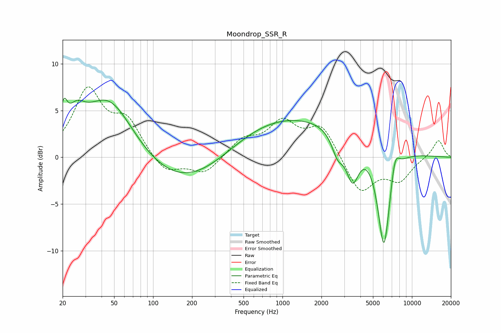

# Moondrop_SSR_R
See [usage instructions](https://github.com/jaakkopasanen/AutoEq#usage) for more options and info.

### Parametric EQs
Apply preamp of -6.4 dB when using parametric equalizer.

|   # | Type    |   Fc (Hz) |    Q |   Gain (dB) |
|-----|---------|-----------|------|-------------|
|   1 | Peaking |        20 | 5.36 |         2.8 |
|   2 | Peaking |        26 | 2.19 |         2.3 |
|   3 | Peaking |        46 | 0.72 |         6.8 |
|   4 | Peaking |       181 | 0.39 |        -3.8 |
|   5 | Peaking |       642 | 0.43 |         1   |
|   6 | Peaking |      1457 | 0.23 |         4   |
|   7 | Peaking |      2667 | 3.06 |        -2.3 |
|   8 | Peaking |      3478 | 2.79 |        -4.5 |
|   9 | Peaking |      6077 | 2.76 |       -11.3 |
|  10 | Peaking |      7402 | 4.12 |         2.5 |

### Fixed Band EQs
When using fixed band (also called graphic) equalizer, apply preamp of **-7.6 dB** (if available) and set gains manually with these parameters.

|   # | Type    |   Fc (Hz) |    Q |   Gain (dB) |
|-----|---------|-----------|------|-------------|
|   1 | Peaking |        31 | 1.41 |         6.9 |
|   2 | Peaking |        62 | 1.41 |         3.6 |
|   3 | Peaking |       125 | 1.41 |        -1.9 |
|   4 | Peaking |       250 | 1.41 |        -1.8 |
|   5 | Peaking |       500 | 1.41 |         1.8 |
|   6 | Peaking |      1000 | 1.41 |         3.5 |
|   7 | Peaking |      2000 | 1.41 |         3.3 |
|   8 | Peaking |      4000 | 1.41 |        -3.9 |
|   9 | Peaking |      8000 | 1.41 |        -2.3 |
|  10 | Peaking |     16000 | 1.41 |         1.9 |

### Graphs

