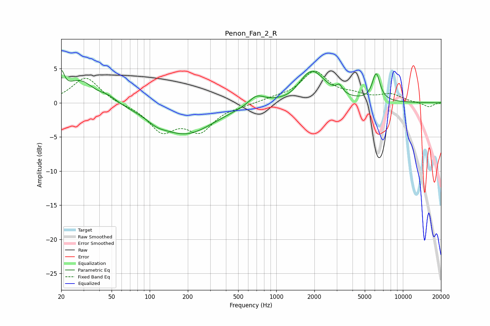

# Penon_Fan_2_R
See [usage instructions](https://github.com/jaakkopasanen/AutoEq#usage) for more options and info.

### Parametric EQs
Apply preamp of -4.8 dB when using parametric equalizer.

|   # | Type    |   Fc (Hz) |    Q |   Gain (dB) |
|-----|---------|-----------|------|-------------|
|   1 | Peaking |        20 | 5.98 |         3   |
|   2 | Peaking |        28 | 1.29 |         3.2 |
|   3 | Peaking |        47 | 2.19 |         0.8 |
|   4 | Peaking |       113 | 2.01 |        -0.7 |
|   5 | Peaking |       191 | 0.63 |        -4.5 |
|   6 | Peaking |       698 | 2.28 |         1.4 |
|   7 | Peaking |      1306 | 1.77 |        -0.6 |
|   8 | Peaking |      1899 | 1.32 |         4.8 |
|   9 | Peaking |      3147 | 6    |         1.1 |
|  10 | Peaking |      6148 | 4.53 |         4   |

### Fixed Band EQs
When using fixed band (also called graphic) equalizer, apply preamp of **-4.7 dB** (if available) and set gains manually with these parameters.

|   # | Type    |   Fc (Hz) |    Q |   Gain (dB) |
|-----|---------|-----------|------|-------------|
|   1 | Peaking |        31 | 1.41 |         3.8 |
|   2 | Peaking |        62 | 1.41 |        -0.2 |
|   3 | Peaking |       125 | 1.41 |        -3.9 |
|   4 | Peaking |       250 | 1.41 |        -3.8 |
|   5 | Peaking |       500 | 1.41 |        -0.3 |
|   6 | Peaking |      1000 | 1.41 |         0.5 |
|   7 | Peaking |      2000 | 1.41 |         4.4 |
|   8 | Peaking |      4000 | 1.41 |         0.9 |
|   9 | Peaking |      8000 | 1.41 |         1.1 |
|  10 | Peaking |     16000 | 1.41 |        -0.7 |

### Graphs

