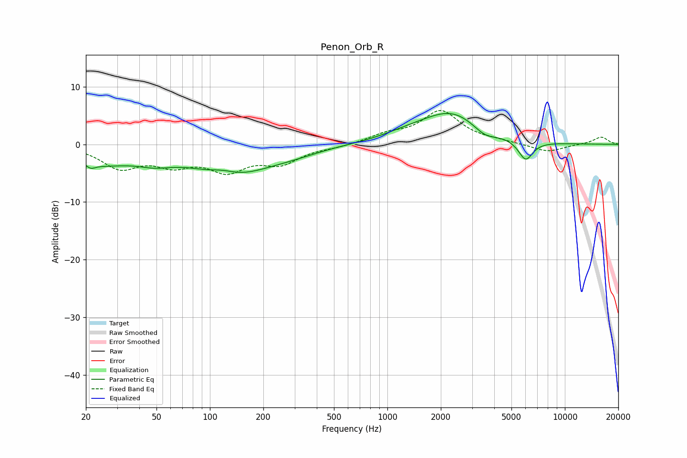

# Penon_Orb_R
See [usage instructions](https://github.com/jaakkopasanen/AutoEq#usage) for more options and info.

### Parametric EQs
Apply preamp of -5.5 dB when using parametric equalizer.

|   # | Type    |   Fc (Hz) |    Q |   Gain (dB) |
|-----|---------|-----------|------|-------------|
|   1 | Peaking |        21 | 5.27 |        -0.9 |
|   2 | Peaking |        24 | 0.87 |        -2.8 |
|   3 | Peaking |        48 | 1.33 |        -1.5 |
|   4 | Peaking |       119 | 1.89 |         0.9 |
|   5 | Peaking |       133 | 0.63 |        -5.1 |
|   6 | Peaking |       300 | 0.95 |        -0.7 |
|   7 | Peaking |      1316 | 0.91 |         1.1 |
|   8 | Peaking |      2315 | 0.84 |         5.2 |
|   9 | Peaking |      3533 | 2.17 |        -1.5 |
|  10 | Peaking |      6013 | 3.35 |        -3.5 |

### Fixed Band EQs
When using fixed band (also called graphic) equalizer, apply preamp of **-6.0 dB** (if available) and set gains manually with these parameters.

|   # | Type    |   Fc (Hz) |    Q |   Gain (dB) |
|-----|---------|-----------|------|-------------|
|   1 | Peaking |        31 | 1.41 |        -3.8 |
|   2 | Peaking |        62 | 1.41 |        -2.9 |
|   3 | Peaking |       125 | 1.41 |        -4   |
|   4 | Peaking |       250 | 1.41 |        -2.9 |
|   5 | Peaking |       500 | 1.41 |        -0.4 |
|   6 | Peaking |      1000 | 1.41 |         1.5 |
|   7 | Peaking |      2000 | 1.41 |         5.6 |
|   8 | Peaking |      4000 | 1.41 |         0.4 |
|   9 | Peaking |      8000 | 1.41 |        -1.4 |
|  10 | Peaking |     16000 | 1.41 |         1.3 |

### Graphs

