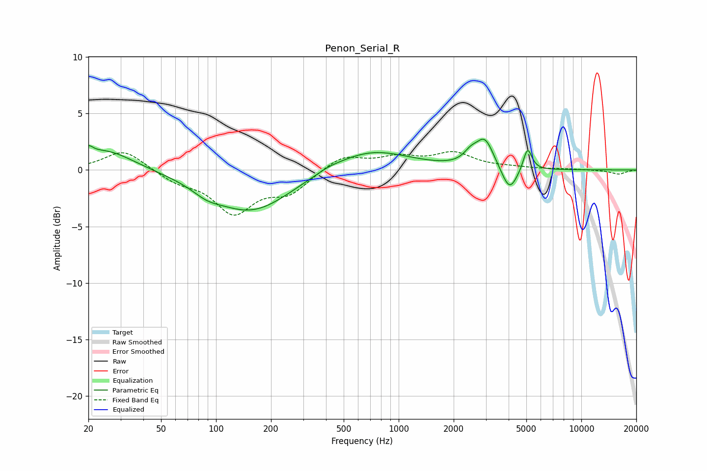

# Penon_Serial_R
See [usage instructions](https://github.com/jaakkopasanen/AutoEq#usage) for more options and info.

### Parametric EQs
Apply preamp of -2.8 dB when using parametric equalizer.

|   # | Type    |   Fc (Hz) |    Q |   Gain (dB) |
|-----|---------|-----------|------|-------------|
|   1 | Peaking |        20 | 5.86 |         0.7 |
|   2 | Peaking |        25 | 0.93 |         1.8 |
|   3 | Peaking |        89 | 1.86 |        -0.6 |
|   4 | Peaking |       156 | 0.65 |        -3.7 |
|   5 | Peaking |       410 | 2.25 |         0.2 |
|   6 | Peaking |       693 | 0.67 |         1.9 |
|   7 | Peaking |      2475 | 3.78 |         0.8 |
|   8 | Peaking |      2964 | 2.88 |         2.5 |
|   9 | Peaking |      4044 | 3.29 |        -2.2 |
|  10 | Peaking |      5078 | 5.99 |         2.1 |

### Fixed Band EQs
When using fixed band (also called graphic) equalizer, apply preamp of **-1.7 dB** (if available) and set gains manually with these parameters.

|   # | Type    |   Fc (Hz) |    Q |   Gain (dB) |
|-----|---------|-----------|------|-------------|
|   1 | Peaking |        31 | 1.41 |         1.8 |
|   2 | Peaking |        62 | 1.41 |        -0.9 |
|   3 | Peaking |       125 | 1.41 |        -3.6 |
|   4 | Peaking |       250 | 1.41 |        -1.9 |
|   5 | Peaking |       500 | 1.41 |         1.3 |
|   6 | Peaking |      1000 | 1.41 |         1   |
|   7 | Peaking |      2000 | 1.41 |         1.4 |
|   8 | Peaking |      4000 | 1.41 |         0.2 |
|   9 | Peaking |      8000 | 1.41 |         0.1 |
|  10 | Peaking |     16000 | 1.41 |        -0.4 |

### Graphs

