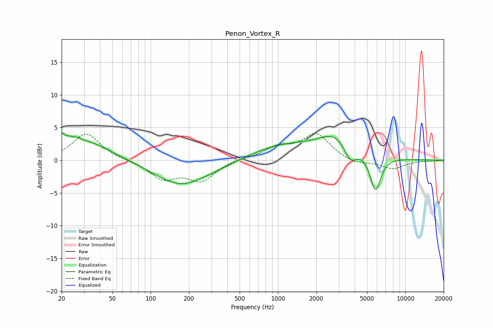

# Penon_Vortex_R
See [usage instructions](https://github.com/jaakkopasanen/AutoEq#usage) for more options and info.

### Parametric EQs
Apply preamp of -4.2 dB when using parametric equalizer.

|   # | Type    |   Fc (Hz) |    Q |   Gain (dB) |
|-----|---------|-----------|------|-------------|
|   1 | Peaking |        20 | 5.81 |         3   |
|   2 | Peaking |        20 | 5.97 |        -1.6 |
|   3 | Peaking |        24 | 2.22 |         0.9 |
|   4 | Peaking |        30 | 0.66 |         2.9 |
|   5 | Peaking |       174 | 0.65 |        -3.9 |
|   6 | Peaking |       356 | 1.81 |        -0.1 |
|   7 | Peaking |      1041 | 0.61 |         2   |
|   8 | Peaking |      2981 | 0.88 |         3.9 |
|   9 | Peaking |      3686 | 2.71 |        -3.1 |
|  10 | Peaking |      5820 | 3.23 |        -5.6 |

### Fixed Band EQs
When using fixed band (also called graphic) equalizer, apply preamp of **-4.2 dB** (if available) and set gains manually with these parameters.

|   # | Type    |   Fc (Hz) |    Q |   Gain (dB) |
|-----|---------|-----------|------|-------------|
|   1 | Peaking |        31 | 1.41 |         4.1 |
|   2 | Peaking |        62 | 1.41 |        -0   |
|   3 | Peaking |       125 | 1.41 |        -2.7 |
|   4 | Peaking |       250 | 1.41 |        -3   |
|   5 | Peaking |       500 | 1.41 |         0.2 |
|   6 | Peaking |      1000 | 1.41 |         1.8 |
|   7 | Peaking |      2000 | 1.41 |         3.9 |
|   8 | Peaking |      4000 | 1.41 |        -0.7 |
|   9 | Peaking |      8000 | 1.41 |        -1.3 |
|  10 | Peaking |     16000 | 1.41 |        -0.1 |

### Graphs

