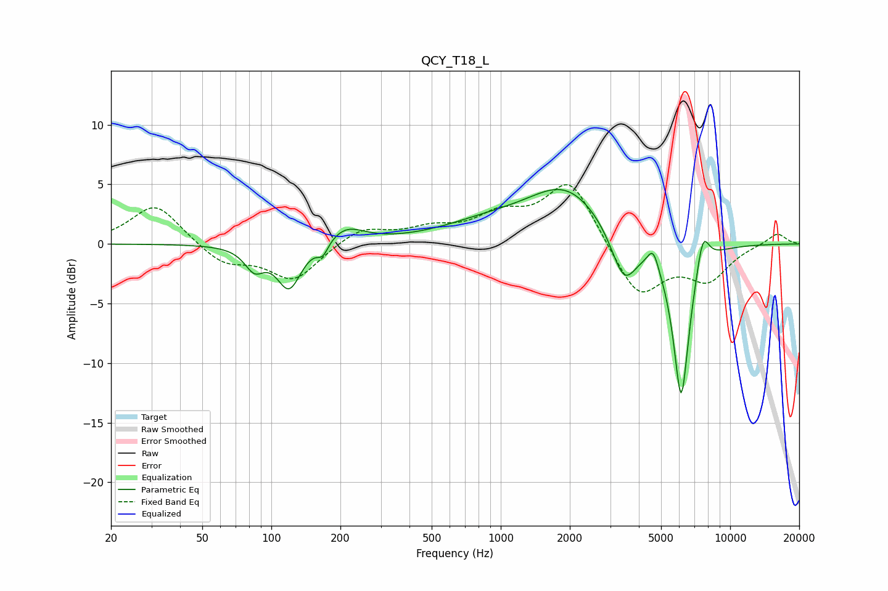

# QCY_T18_L
See [usage instructions](https://github.com/jaakkopasanen/AutoEq#usage) for more options and info.

### Parametric EQs
Apply preamp of -4.7 dB when using parametric equalizer.

|   # | Type    |   Fc (Hz) |    Q |   Gain (dB) |
|-----|---------|-----------|------|-------------|
|   1 | Peaking |        84 | 3.38 |        -1.8 |
|   2 | Peaking |       120 | 2.7  |        -3.8 |
|   3 | Peaking |       168 | 5.76 |        -1.1 |
|   4 | Peaking |       211 | 1.77 |         1.4 |
|   5 | Peaking |       863 | 0.69 |         1.3 |
|   6 | Peaking |      1931 | 0.83 |         4.5 |
|   7 | Peaking |      3445 | 2.46 |        -4.3 |
|   8 | Peaking |      4616 | 6    |         1.6 |
|   9 | Peaking |      6119 | 3.71 |       -13.4 |
|  10 | Peaking |      7597 | 4.8  |         3.1 |

### Fixed Band EQs
When using fixed band (also called graphic) equalizer, apply preamp of **-5.1 dB** (if available) and set gains manually with these parameters.

|   # | Type    |   Fc (Hz) |    Q |   Gain (dB) |
|-----|---------|-----------|------|-------------|
|   1 | Peaking |        31 | 1.41 |         3.4 |
|   2 | Peaking |        62 | 1.41 |        -1.7 |
|   3 | Peaking |       125 | 1.41 |        -3   |
|   4 | Peaking |       250 | 1.41 |         1.4 |
|   5 | Peaking |       500 | 1.41 |         1.1 |
|   6 | Peaking |      1000 | 1.41 |         2.1 |
|   7 | Peaking |      2000 | 1.41 |         5.4 |
|   8 | Peaking |      4000 | 1.41 |        -4.6 |
|   9 | Peaking |      8000 | 1.41 |        -2.8 |
|  10 | Peaking |     16000 | 1.41 |         1   |

### Graphs

