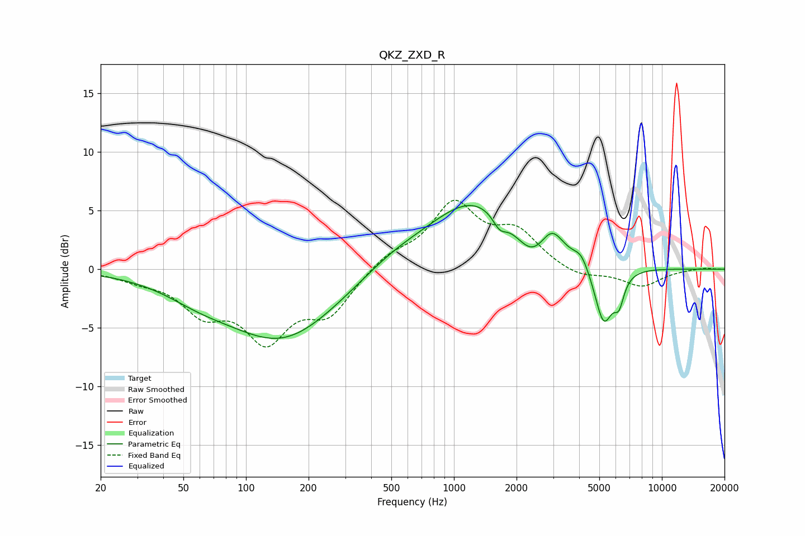

# QKZ_ZXD_R
See [usage instructions](https://github.com/jaakkopasanen/AutoEq#usage) for more options and info.

### Parametric EQs
Apply preamp of -5.5 dB when using parametric equalizer.

|   # | Type    |   Fc (Hz) |    Q |   Gain (dB) |
|-----|---------|-----------|------|-------------|
|   1 | Peaking |        59 | 0.84 |        -1.1 |
|   2 | Peaking |       150 | 0.53 |        -5.9 |
|   3 | Peaking |       506 | 0.86 |         1   |
|   4 | Peaking |      1259 | 0.63 |         5.9 |
|   5 | Peaking |      1659 | 4.23 |        -1.2 |
|   6 | Peaking |      2361 | 1.87 |        -2.1 |
|   7 | Peaking |      2963 | 2.61 |         2.1 |
|   8 | Peaking |      4091 | 3.92 |         1   |
|   9 | Peaking |      5250 | 3.13 |        -5   |
|  10 | Peaking |      6219 | 5.67 |        -2.1 |

### Fixed Band EQs
When using fixed band (also called graphic) equalizer, apply preamp of **-6.0 dB** (if available) and set gains manually with these parameters.

|   # | Type    |   Fc (Hz) |    Q |   Gain (dB) |
|-----|---------|-----------|------|-------------|
|   1 | Peaking |        31 | 1.41 |        -0.7 |
|   2 | Peaking |        62 | 1.41 |        -3.2 |
|   3 | Peaking |       125 | 1.41 |        -5.5 |
|   4 | Peaking |       250 | 1.41 |        -3.4 |
|   5 | Peaking |       500 | 1.41 |         1.2 |
|   6 | Peaking |      1000 | 1.41 |         5.3 |
|   7 | Peaking |      2000 | 1.41 |         2.9 |
|   8 | Peaking |      4000 | 1.41 |        -0.8 |
|   9 | Peaking |      8000 | 1.41 |        -1.4 |
|  10 | Peaking |     16000 | 1.41 |         0.1 |

### Graphs

