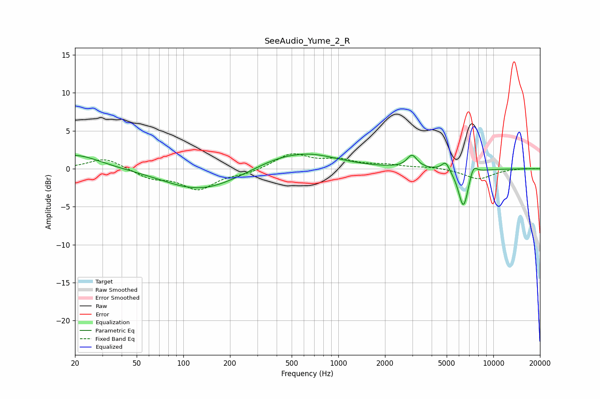

# SeeAudio_Yume_2_R
See [usage instructions](https://github.com/jaakkopasanen/AutoEq#usage) for more options and info.

### Parametric EQs
Apply preamp of -2.0 dB when using parametric equalizer.

|   # | Type    |   Fc (Hz) |    Q |   Gain (dB) |
|-----|---------|-----------|------|-------------|
|   1 | Peaking |        20 | 0.88 |         1.9 |
|   2 | Peaking |       113 | 0.66 |        -1.9 |
|   3 | Peaking |       164 | 0.72 |        -1.1 |
|   4 | Peaking |       356 | 1.51 |         0.1 |
|   5 | Peaking |       553 | 1.74 |        -0.2 |
|   6 | Peaking |       570 | 0.67 |         2.4 |
|   7 | Peaking |      2987 | 4.42 |         1.7 |
|   8 | Peaking |      4923 | 5.59 |         1.3 |
|   9 | Peaking |      6414 | 4.15 |        -5.2 |
|  10 | Peaking |      7420 | 5.23 |         1.5 |

### Fixed Band EQs
When using fixed band (also called graphic) equalizer, apply preamp of **-2.1 dB** (if available) and set gains manually with these parameters.

|   # | Type    |   Fc (Hz) |    Q |   Gain (dB) |
|-----|---------|-----------|------|-------------|
|   1 | Peaking |        31 | 1.41 |         1.5 |
|   2 | Peaking |        62 | 1.41 |        -1.2 |
|   3 | Peaking |       125 | 1.41 |        -2.6 |
|   4 | Peaking |       250 | 1.41 |        -0.5 |
|   5 | Peaking |       500 | 1.41 |         2   |
|   6 | Peaking |      1000 | 1.41 |         1   |
|   7 | Peaking |      2000 | 1.41 |         0.4 |
|   8 | Peaking |      4000 | 1.41 |         0.2 |
|   9 | Peaking |      8000 | 1.41 |        -1.4 |
|  10 | Peaking |     16000 | 1.41 |         0.1 |

### Graphs

