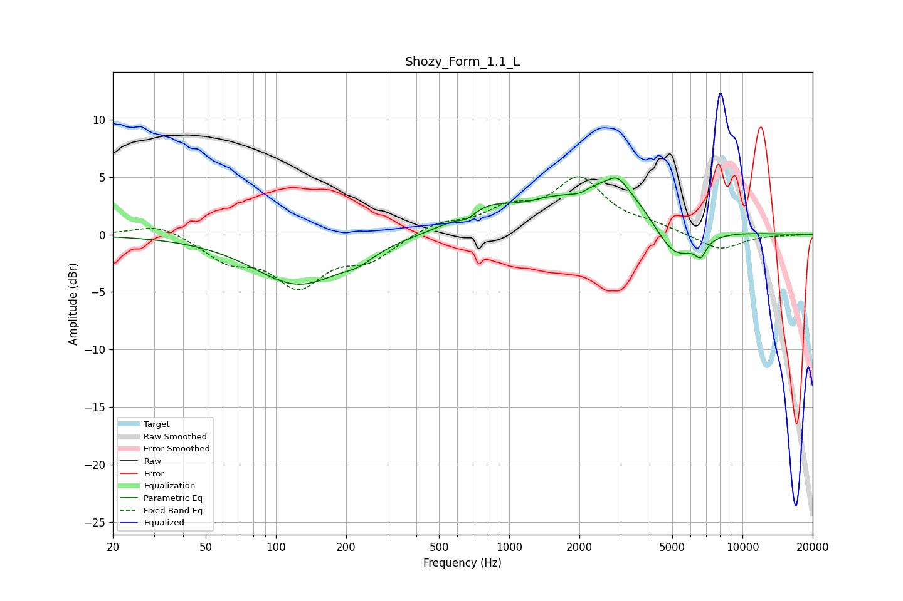

# Shozy_Form_1.1_L
See [usage instructions](https://github.com/jaakkopasanen/AutoEq#usage) for more options and info.

### Parametric EQs
Apply preamp of -5.0 dB when using parametric equalizer.

|   # | Type    |   Fc (Hz) |    Q |   Gain (dB) |
|-----|---------|-----------|------|-------------|
|   1 | Peaking |       125 | 0.73 |        -4.3 |
|   2 | Peaking |       226 | 2.19 |        -0.7 |
|   3 | Peaking |       663 | 3.7  |        -0.7 |
|   4 | Peaking |       785 | 1.05 |         2   |
|   5 | Peaking |      1409 | 2.2  |         0.3 |
|   6 | Peaking |      2000 | 3.5  |        -0.5 |
|   7 | Peaking |      2839 | 0.64 |         4.9 |
|   8 | Peaking |      2919 | 3.7  |         1   |
|   9 | Peaking |      5106 | 1.35 |        -4.3 |
|  10 | Peaking |      6633 | 6    |        -1.3 |

### Fixed Band EQs
When using fixed band (also called graphic) equalizer, apply preamp of **-5.1 dB** (if available) and set gains manually with these parameters.

|   # | Type    |   Fc (Hz) |    Q |   Gain (dB) |
|-----|---------|-----------|------|-------------|
|   1 | Peaking |        31 | 1.41 |         1   |
|   2 | Peaking |        62 | 1.41 |        -2   |
|   3 | Peaking |       125 | 1.41 |        -4.2 |
|   4 | Peaking |       250 | 1.41 |        -2   |
|   5 | Peaking |       500 | 1.41 |         1   |
|   6 | Peaking |      1000 | 1.41 |         1.9 |
|   7 | Peaking |      2000 | 1.41 |         4.6 |
|   8 | Peaking |      4000 | 1.41 |         0.6 |
|   9 | Peaking |      8000 | 1.41 |        -1.4 |
|  10 | Peaking |     16000 | 1.41 |        -0   |

### Graphs

