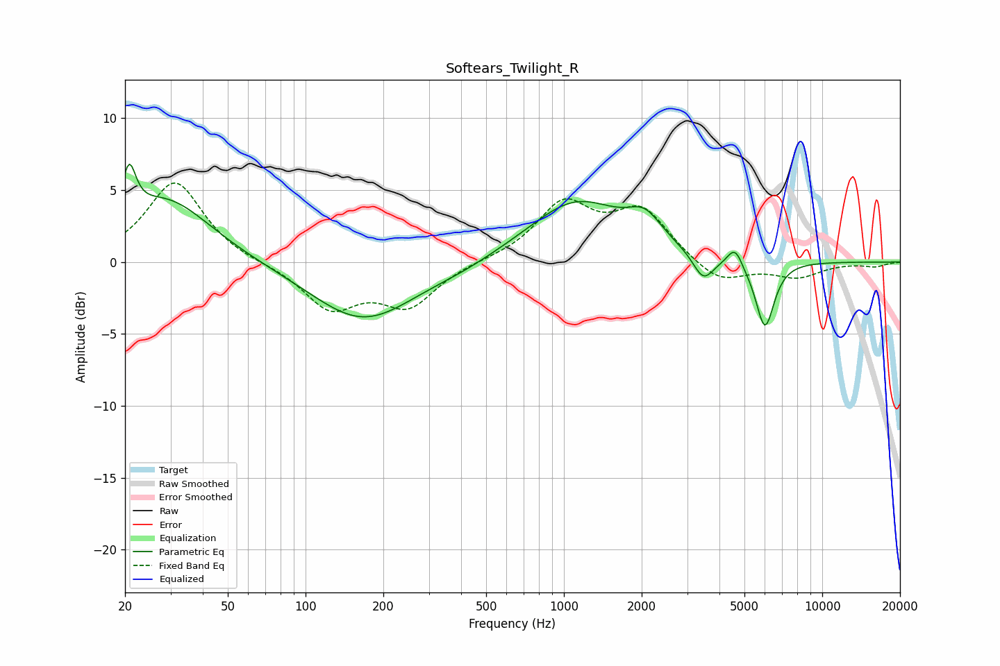

# Softears_Twilight_R
See [usage instructions](https://github.com/jaakkopasanen/AutoEq#usage) for more options and info.

### Parametric EQs
Apply preamp of -6.9 dB when using parametric equalizer.

|   # | Type    |   Fc (Hz) |    Q |   Gain (dB) |
|-----|---------|-----------|------|-------------|
|   1 | Peaking |        21 | 5.44 |         3.5 |
|   2 | Peaking |        29 | 0.81 |         4.4 |
|   3 | Peaking |       167 | 0.7  |        -4.1 |
|   4 | Peaking |       400 | 1.18 |        -0.3 |
|   5 | Peaking |      1116 | 0.76 |         4.2 |
|   6 | Peaking |      2058 | 2.14 |         1.8 |
|   7 | Peaking |      3464 | 3.46 |        -1.8 |
|   8 | Peaking |      4445 | 5.93 |         0.5 |
|   9 | Peaking |      4666 | 5.96 |         0.9 |
|  10 | Peaking |      6002 | 3.83 |        -4.7 |

### Fixed Band EQs
When using fixed band (also called graphic) equalizer, apply preamp of **-5.6 dB** (if available) and set gains manually with these parameters.

|   # | Type    |   Fc (Hz) |    Q |   Gain (dB) |
|-----|---------|-----------|------|-------------|
|   1 | Peaking |        31 | 1.41 |         5.6 |
|   2 | Peaking |        62 | 1.41 |        -0.1 |
|   3 | Peaking |       125 | 1.41 |        -3.1 |
|   4 | Peaking |       250 | 1.41 |        -2.9 |
|   5 | Peaking |       500 | 1.41 |         0.1 |
|   6 | Peaking |      1000 | 1.41 |         3.9 |
|   7 | Peaking |      2000 | 1.41 |         3.4 |
|   8 | Peaking |      4000 | 1.41 |        -1.6 |
|   9 | Peaking |      8000 | 1.41 |        -1   |
|  10 | Peaking |     16000 | 1.41 |        -0.3 |

### Graphs

