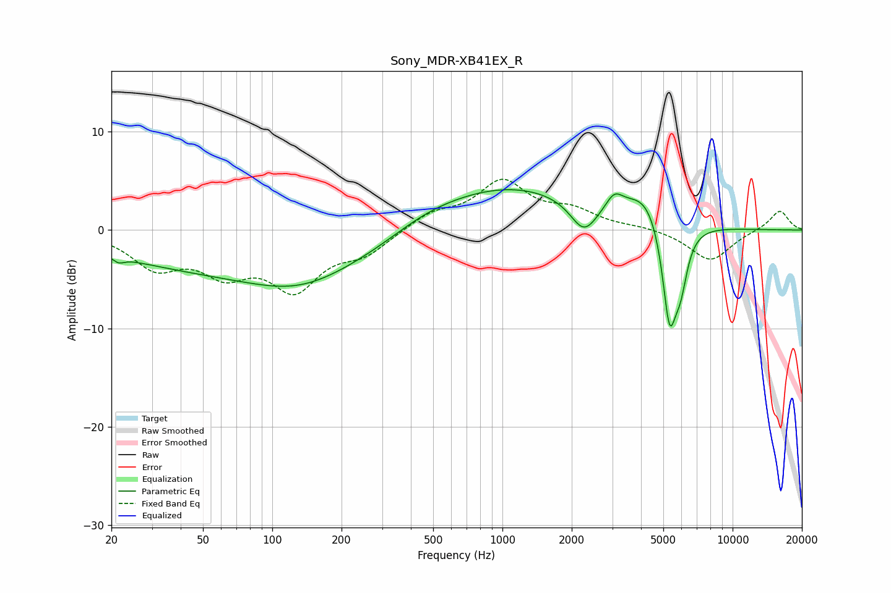

# Sony_MDR-XB41EX_R
See [usage instructions](https://github.com/jaakkopasanen/AutoEq#usage) for more options and info.

### Parametric EQs
Apply preamp of -4.2 dB when using parametric equalizer.

|   # | Type    |   Fc (Hz) |    Q |   Gain (dB) |
|-----|---------|-----------|------|-------------|
|   1 | Peaking |        22 | 5.89 |        -0.6 |
|   2 | Peaking |        99 | 0.18 |        -4.4 |
|   3 | Peaking |       130 | 0.69 |        -1.9 |
|   4 | Peaking |       456 | 0.85 |         1.1 |
|   5 | Peaking |       971 | 0.39 |         4.9 |
|   6 | Peaking |      2262 | 2.4  |        -3.2 |
|   7 | Peaking |      3062 | 3.94 |         1.5 |
|   8 | Peaking |      4295 | 1.5  |         3.5 |
|   9 | Peaking |      5318 | 4.11 |       -10.9 |
|  10 | Peaking |      5948 | 4.61 |        -4.2 |

### Fixed Band EQs
When using fixed band (also called graphic) equalizer, apply preamp of **-5.3 dB** (if available) and set gains manually with these parameters.

|   # | Type    |   Fc (Hz) |    Q |   Gain (dB) |
|-----|---------|-----------|------|-------------|
|   1 | Peaking |        31 | 1.41 |        -3.4 |
|   2 | Peaking |        62 | 1.41 |        -3.6 |
|   3 | Peaking |       125 | 1.41 |        -5.5 |
|   4 | Peaking |       250 | 1.41 |        -2.1 |
|   5 | Peaking |       500 | 1.41 |         1.6 |
|   6 | Peaking |      1000 | 1.41 |         4.7 |
|   7 | Peaking |      2000 | 1.41 |         1.7 |
|   8 | Peaking |      4000 | 1.41 |         0.3 |
|   9 | Peaking |      8000 | 1.41 |        -3.2 |
|  10 | Peaking |     16000 | 1.41 |         2.1 |

### Graphs

