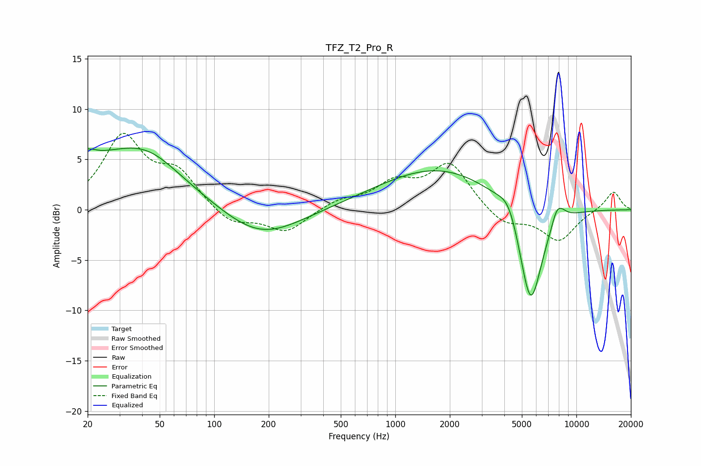

# TFZ_T2_Pro_R
See [usage instructions](https://github.com/jaakkopasanen/AutoEq#usage) for more options and info.

### Parametric EQs
Apply preamp of -6.2 dB when using parametric equalizer.

|   # | Type    |   Fc (Hz) |    Q |   Gain (dB) |
|-----|---------|-----------|------|-------------|
|   1 | Peaking |        20 | 5.08 |         3.7 |
|   2 | Peaking |        20 | 5.95 |        -2.8 |
|   3 | Peaking |        28 | 0.39 |         5   |
|   4 | Peaking |        43 | 0.93 |         1.7 |
|   5 | Peaking |       180 | 0.66 |        -3   |
|   6 | Peaking |      1743 | 0.42 |         4.2 |
|   7 | Peaking |      4246 | 2.47 |         2.1 |
|   8 | Peaking |      5583 | 2.02 |       -10.9 |
|   9 | Peaking |      7947 | 3.9  |         2.7 |
|  10 | Peaking |      8068 | 6    |        -0.7 |

### Fixed Band EQs
When using fixed band (also called graphic) equalizer, apply preamp of **-7.7 dB** (if available) and set gains manually with these parameters.

|   # | Type    |   Fc (Hz) |    Q |   Gain (dB) |
|-----|---------|-----------|------|-------------|
|   1 | Peaking |        31 | 1.41 |         7   |
|   2 | Peaking |        62 | 1.41 |         3.3 |
|   3 | Peaking |       125 | 1.41 |        -1.6 |
|   4 | Peaking |       250 | 1.41 |        -2.2 |
|   5 | Peaking |       500 | 1.41 |         0.9 |
|   6 | Peaking |      1000 | 1.41 |         2.4 |
|   7 | Peaking |      2000 | 1.41 |         4.5 |
|   8 | Peaking |      4000 | 1.41 |        -1.6 |
|   9 | Peaking |      8000 | 1.41 |        -3   |
|  10 | Peaking |     16000 | 1.41 |         1.9 |

### Graphs

