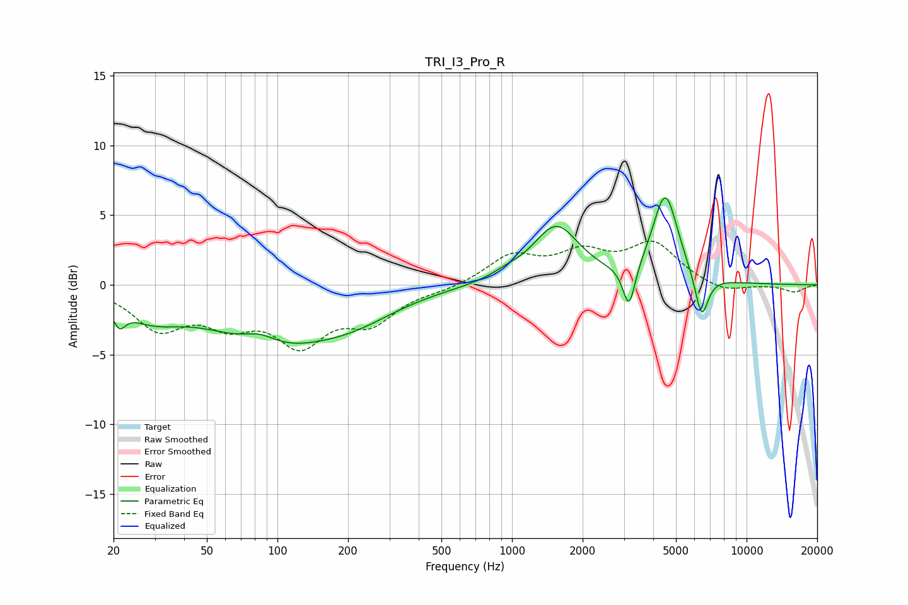

# TRI_I3_Pro_R
See [usage instructions](https://github.com/jaakkopasanen/AutoEq#usage) for more options and info.

### Parametric EQs
Apply preamp of -6.3 dB when using parametric equalizer.

|   # | Type    |   Fc (Hz) |    Q |   Gain (dB) |
|-----|---------|-----------|------|-------------|
|   1 | Peaking |        21 | 5.47 |        -1.3 |
|   2 | Peaking |        29 | 1.11 |        -1.7 |
|   3 | Peaking |        84 | 1.9  |         0.9 |
|   4 | Peaking |        93 | 0.55 |        -3.9 |
|   5 | Peaking |       214 | 0.76 |        -1.5 |
|   6 | Peaking |       948 | 2.08 |         0.4 |
|   7 | Peaking |      1543 | 1.44 |         4.1 |
|   8 | Peaking |      3154 | 5.45 |        -3.1 |
|   9 | Peaking |      4502 | 2.59 |         6.4 |
|  10 | Peaking |      6430 | 4.86 |        -3.2 |

### Fixed Band EQs
When using fixed band (also called graphic) equalizer, apply preamp of **-3.2 dB** (if available) and set gains manually with these parameters.

|   # | Type    |   Fc (Hz) |    Q |   Gain (dB) |
|-----|---------|-----------|------|-------------|
|   1 | Peaking |        31 | 1.41 |        -2.9 |
|   2 | Peaking |        62 | 1.41 |        -2.2 |
|   3 | Peaking |       125 | 1.41 |        -3.8 |
|   4 | Peaking |       250 | 1.41 |        -2.4 |
|   5 | Peaking |       500 | 1.41 |        -0.3 |
|   6 | Peaking |      1000 | 1.41 |         2   |
|   7 | Peaking |      2000 | 1.41 |         2   |
|   8 | Peaking |      4000 | 1.41 |         2.8 |
|   9 | Peaking |      8000 | 1.41 |        -0.6 |
|  10 | Peaking |     16000 | 1.41 |        -0.5 |

### Graphs

