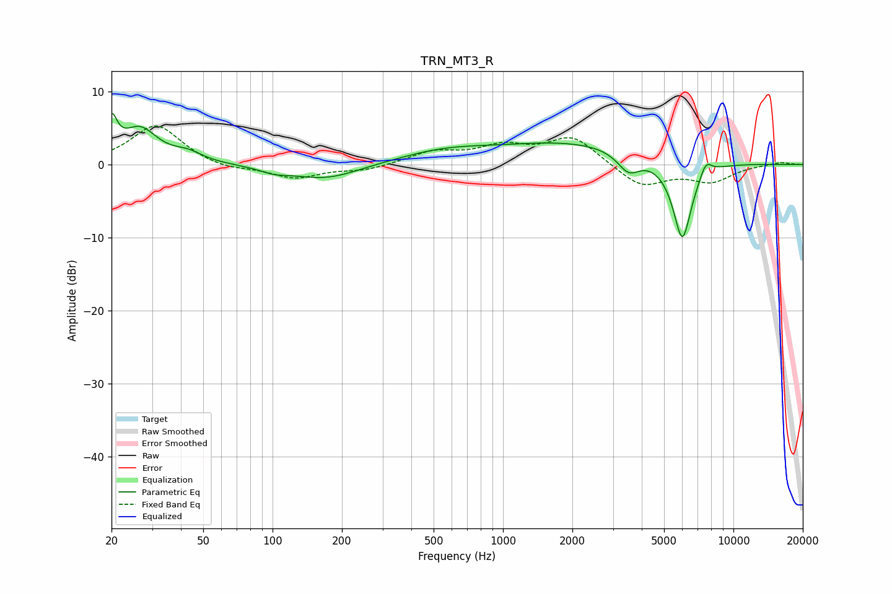

# TRN_MT3_R
See [usage instructions](https://github.com/jaakkopasanen/AutoEq#usage) for more options and info.

### Parametric EQs
Apply preamp of -7.1 dB when using parametric equalizer.

|   # | Type    |   Fc (Hz) |    Q |   Gain (dB) |
|-----|---------|-----------|------|-------------|
|   1 | Peaking |        20 | 6    |         4.7 |
|   2 | Peaking |        27 | 1.83 |         4.7 |
|   3 | Peaking |        43 | 2.22 |         1.2 |
|   4 | Peaking |       102 | 2.22 |        -0.7 |
|   5 | Peaking |       170 | 0.96 |        -2.1 |
|   6 | Peaking |       551 | 0.71 |         1.5 |
|   7 | Peaking |      2019 | 0.43 |         2.9 |
|   8 | Peaking |      3509 | 2.89 |        -2.7 |
|   9 | Peaking |      6001 | 3.26 |       -11.1 |
|  10 | Peaking |      7590 | 5.18 |         2   |

### Fixed Band EQs
When using fixed band (also called graphic) equalizer, apply preamp of **-5.4 dB** (if available) and set gains manually with these parameters.

|   # | Type    |   Fc (Hz) |    Q |   Gain (dB) |
|-----|---------|-----------|------|-------------|
|   1 | Peaking |        31 | 1.41 |         5.5 |
|   2 | Peaking |        62 | 1.41 |        -0.8 |
|   3 | Peaking |       125 | 1.41 |        -1.8 |
|   4 | Peaking |       250 | 1.41 |        -0.8 |
|   5 | Peaking |       500 | 1.41 |         1.6 |
|   6 | Peaking |      1000 | 1.41 |         2.2 |
|   7 | Peaking |      2000 | 1.41 |         3.8 |
|   8 | Peaking |      4000 | 1.41 |        -3.1 |
|   9 | Peaking |      8000 | 1.41 |        -2.2 |
|  10 | Peaking |     16000 | 1.41 |         0.4 |

### Graphs

