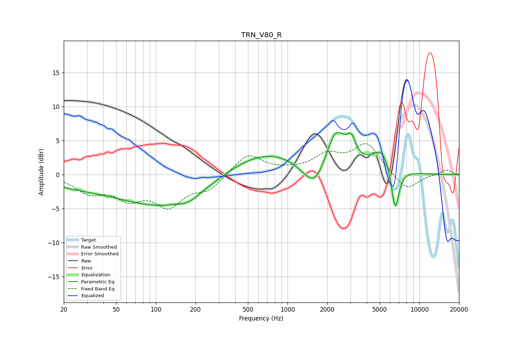

# TRN_V80_R
See [usage instructions](https://github.com/jaakkopasanen/AutoEq#usage) for more options and info.

### Parametric EQs
Apply preamp of -6.3 dB when using parametric equalizer.

|   # | Type    |   Fc (Hz) |    Q |   Gain (dB) |
|-----|---------|-----------|------|-------------|
|   1 | Peaking |        21 | 1.71 |        -0.4 |
|   2 | Peaking |        30 | 0.76 |        -0.9 |
|   3 | Peaking |       114 | 0.4  |        -4.6 |
|   4 | Peaking |       178 | 1.84 |        -0.9 |
|   5 | Peaking |       671 | 0.47 |         3.7 |
|   6 | Peaking |      1620 | 1.53 |        -4.9 |
|   7 | Peaking |      2314 | 1.69 |         6.6 |
|   8 | Peaking |      3048 | 4.56 |         2.4 |
|   9 | Peaking |      5205 | 1.86 |         3.3 |
|  10 | Peaking |      6553 | 4.53 |        -6.7 |

### Fixed Band EQs
When using fixed band (also called graphic) equalizer, apply preamp of **-4.6 dB** (if available) and set gains manually with these parameters.

|   # | Type    |   Fc (Hz) |    Q |   Gain (dB) |
|-----|---------|-----------|------|-------------|
|   1 | Peaking |        31 | 1.41 |        -2.4 |
|   2 | Peaking |        62 | 1.41 |        -3   |
|   3 | Peaking |       125 | 1.41 |        -4.2 |
|   4 | Peaking |       250 | 1.41 |        -2   |
|   5 | Peaking |       500 | 1.41 |         3.1 |
|   6 | Peaking |      1000 | 1.41 |         0.4 |
|   7 | Peaking |      2000 | 1.41 |         2.6 |
|   8 | Peaking |      4000 | 1.41 |         4.4 |
|   9 | Peaking |      8000 | 1.41 |        -2.5 |
|  10 | Peaking |     16000 | 1.41 |         0.7 |

### Graphs

