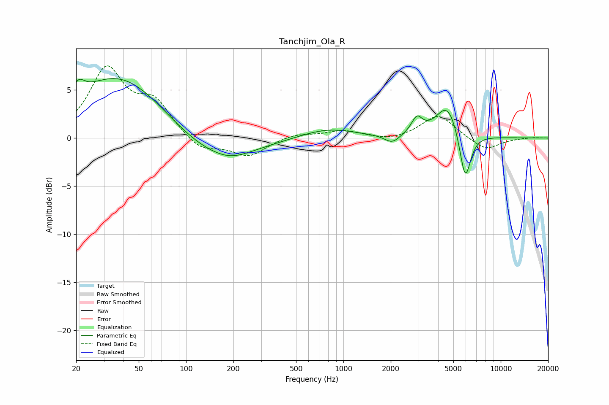

# Tanchjim_Ola_R
See [usage instructions](https://github.com/jaakkopasanen/AutoEq#usage) for more options and info.

### Parametric EQs
Apply preamp of -6.3 dB when using parametric equalizer.

|   # | Type    |   Fc (Hz) |    Q |   Gain (dB) |
|-----|---------|-----------|------|-------------|
|   1 | Peaking |        21 | 5.19 |         3.5 |
|   2 | Peaking |        21 | 6    |        -2.2 |
|   3 | Peaking |        38 | 0.46 |         6.8 |
|   4 | Peaking |       138 | 0.52 |        -2.8 |
|   5 | Peaking |       194 | 1.27 |        -0.6 |
|   6 | Peaking |       791 | 0.81 |         1   |
|   7 | Peaking |      2040 | 2.96 |        -0.9 |
|   8 | Peaking |      2931 | 4.07 |         1.7 |
|   9 | Peaking |      4598 | 1.9  |         3.6 |
|  10 | Peaking |      5938 | 3.82 |        -5.3 |

### Fixed Band EQs
When using fixed band (also called graphic) equalizer, apply preamp of **-7.6 dB** (if available) and set gains manually with these parameters.

|   # | Type    |   Fc (Hz) |    Q |   Gain (dB) |
|-----|---------|-----------|------|-------------|
|   1 | Peaking |        31 | 1.41 |         6.9 |
|   2 | Peaking |        62 | 1.41 |         3.4 |
|   3 | Peaking |       125 | 1.41 |        -1.5 |
|   4 | Peaking |       250 | 1.41 |        -1.8 |
|   5 | Peaking |       500 | 1.41 |         0.5 |
|   6 | Peaking |      1000 | 1.41 |         0.8 |
|   7 | Peaking |      2000 | 1.41 |        -0.3 |
|   8 | Peaking |      4000 | 1.41 |         2.5 |
|   9 | Peaking |      8000 | 1.41 |        -1.3 |
|  10 | Peaking |     16000 | 1.41 |         0.1 |

### Graphs

