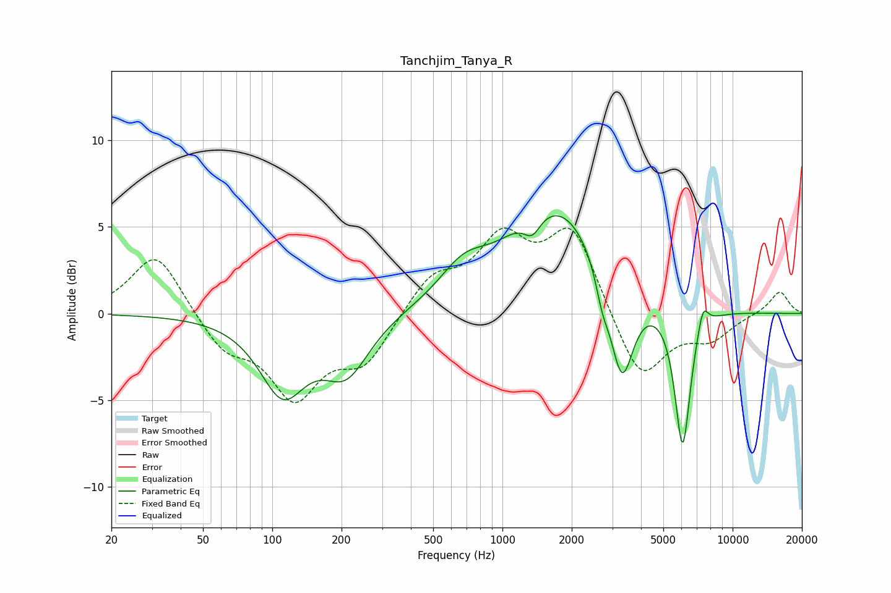

# Tanchjim_Tanya_R
See [usage instructions](https://github.com/jaakkopasanen/AutoEq#usage) for more options and info.

### Parametric EQs
Apply preamp of -5.7 dB when using parametric equalizer.

|   # | Type    |   Fc (Hz) |    Q |   Gain (dB) |
|-----|---------|-----------|------|-------------|
|   1 | Peaking |       111 | 1.41 |        -4.3 |
|   2 | Peaking |       210 | 1.4  |        -3.2 |
|   3 | Peaking |       679 | 1.34 |         1.8 |
|   4 | Peaking |      1147 | 1.7  |         0.3 |
|   5 | Peaking |      1348 | 3.89 |        -1.1 |
|   6 | Peaking |      1764 | 0.69 |         6.1 |
|   7 | Peaking |      2715 | 4.84 |        -1.4 |
|   8 | Peaking |      3298 | 2.69 |        -6.1 |
|   9 | Peaking |      6063 | 4.05 |        -8.2 |
|  10 | Peaking |      7434 | 5.97 |         1.4 |

### Fixed Band EQs
When using fixed band (also called graphic) equalizer, apply preamp of **-5.0 dB** (if available) and set gains manually with these parameters.

|   # | Type    |   Fc (Hz) |    Q |   Gain (dB) |
|-----|---------|-----------|------|-------------|
|   1 | Peaking |        31 | 1.41 |         3.6 |
|   2 | Peaking |        62 | 1.41 |        -2   |
|   3 | Peaking |       125 | 1.41 |        -4.5 |
|   4 | Peaking |       250 | 1.41 |        -2.7 |
|   5 | Peaking |       500 | 1.41 |         2.1 |
|   6 | Peaking |      1000 | 1.41 |         3.9 |
|   7 | Peaking |      2000 | 1.41 |         4.8 |
|   8 | Peaking |      4000 | 1.41 |        -4   |
|   9 | Peaking |      8000 | 1.41 |        -1.3 |
|  10 | Peaking |     16000 | 1.41 |         1.3 |

### Graphs

