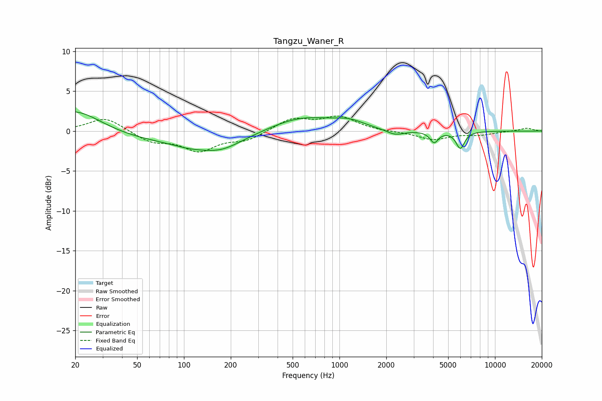

# Tangzu_Waner_R
See [usage instructions](https://github.com/jaakkopasanen/AutoEq#usage) for more options and info.

### Parametric EQs
Apply preamp of -2.5 dB when using parametric equalizer.

|   # | Type    |   Fc (Hz) |    Q |   Gain (dB) |
|-----|---------|-----------|------|-------------|
|   1 | Peaking |        20 | 0.83 |         2.9 |
|   2 | Peaking |        85 | 0.31 |        -1.4 |
|   3 | Peaking |       110 | 1.3  |        -0.6 |
|   4 | Peaking |       123 | 1.17 |         0.1 |
|   5 | Peaking |       172 | 1.05 |        -1.5 |
|   6 | Peaking |       574 | 0.68 |         1.9 |
|   7 | Peaking |      1159 | 1.52 |         0.8 |
|   8 | Peaking |      2281 | 2.39 |        -0.7 |
|   9 | Peaking |      4064 | 5.28 |        -1.4 |
|  10 | Peaking |      5986 | 5.06 |        -2.1 |

### Fixed Band EQs
When using fixed band (also called graphic) equalizer, apply preamp of **-2.0 dB** (if available) and set gains manually with these parameters.

|   # | Type    |   Fc (Hz) |    Q |   Gain (dB) |
|-----|---------|-----------|------|-------------|
|   1 | Peaking |        31 | 1.41 |         1.8 |
|   2 | Peaking |        62 | 1.41 |        -1.3 |
|   3 | Peaking |       125 | 1.41 |        -2.3 |
|   4 | Peaking |       250 | 1.41 |        -1.1 |
|   5 | Peaking |       500 | 1.41 |         1.5 |
|   6 | Peaking |      1000 | 1.41 |         1.7 |
|   7 | Peaking |      2000 | 1.41 |        -0.1 |
|   8 | Peaking |      4000 | 1.41 |        -1.1 |
|   9 | Peaking |      8000 | 1.41 |        -0.4 |
|  10 | Peaking |     16000 | 1.41 |         0.4 |

### Graphs

