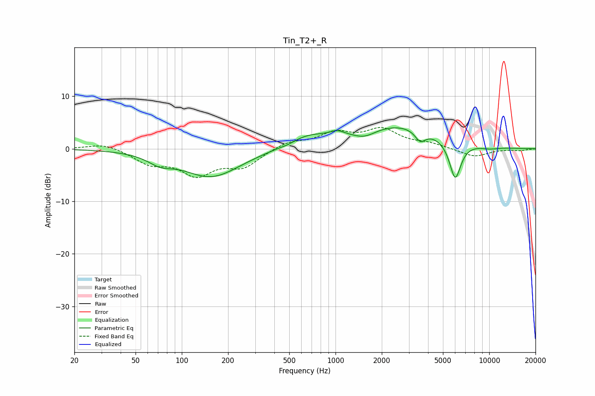

# Tin_T2+_R
See [usage instructions](https://github.com/jaakkopasanen/AutoEq#usage) for more options and info.

### Parametric EQs
Apply preamp of -4.1 dB when using parametric equalizer.

|   # | Type    |   Fc (Hz) |    Q |   Gain (dB) |
|-----|---------|-----------|------|-------------|
|   1 | Peaking |        72 | 1.84 |        -1.6 |
|   2 | Peaking |       156 | 0.76 |        -5.3 |
|   3 | Peaking |       492 | 3.63 |        -0.3 |
|   4 | Peaking |       659 | 1.07 |         2.1 |
|   5 | Peaking |      1026 | 2.87 |         1   |
|   6 | Peaking |      1548 | 1.99 |        -1.3 |
|   7 | Peaking |      2585 | 0.52 |         4.4 |
|   8 | Peaking |      3560 | 4.14 |        -2.1 |
|   9 | Peaking |      6007 | 3.62 |        -7.4 |
|  10 | Peaking |     10000 | 1.94 |        -0.4 |

### Fixed Band EQs
When using fixed band (also called graphic) equalizer, apply preamp of **-4.1 dB** (if available) and set gains manually with these parameters.

|   # | Type    |   Fc (Hz) |    Q |   Gain (dB) |
|-----|---------|-----------|------|-------------|
|   1 | Peaking |        31 | 1.41 |         1.1 |
|   2 | Peaking |        62 | 1.41 |        -2.6 |
|   3 | Peaking |       125 | 1.41 |        -4.5 |
|   4 | Peaking |       250 | 1.41 |        -3.2 |
|   5 | Peaking |       500 | 1.41 |         1.3 |
|   6 | Peaking |      1000 | 1.41 |         2.8 |
|   7 | Peaking |      2000 | 1.41 |         3.4 |
|   8 | Peaking |      4000 | 1.41 |         0.9 |
|   9 | Peaking |      8000 | 1.41 |        -1.5 |
|  10 | Peaking |     16000 | 1.41 |        -0.3 |

### Graphs

