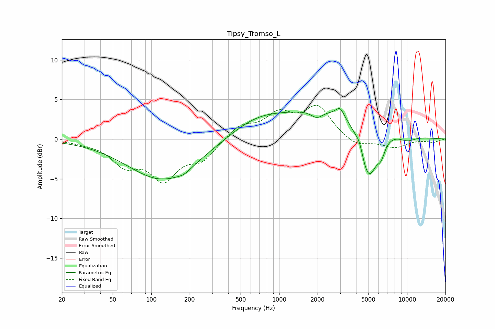

# Tipsy_Tromso_L
See [usage instructions](https://github.com/jaakkopasanen/AutoEq#usage) for more options and info.

### Parametric EQs
Apply preamp of -4.0 dB when using parametric equalizer.

|   # | Type    |   Fc (Hz) |    Q |   Gain (dB) |
|-----|---------|-----------|------|-------------|
|   1 | Peaking |       124 | 0.51 |        -5.2 |
|   2 | Peaking |       180 | 2.79 |        -0.4 |
|   3 | Peaking |       668 | 0.64 |         2.2 |
|   4 | Peaking |      1976 | 2.99 |        -1   |
|   5 | Peaking |      2797 | 0.38 |         3.8 |
|   6 | Peaking |      2995 | 4.51 |         1.2 |
|   7 | Peaking |      4240 | 5.81 |         0.9 |
|   8 | Peaking |      5002 | 2    |        -7.3 |
|   9 | Peaking |      6271 | 4.4  |        -1.6 |
|  10 | Peaking |     10000 | 1.71 |        -0.8 |

### Fixed Band EQs
When using fixed band (also called graphic) equalizer, apply preamp of **-4.4 dB** (if available) and set gains manually with these parameters.

|   # | Type    |   Fc (Hz) |    Q |   Gain (dB) |
|-----|---------|-----------|------|-------------|
|   1 | Peaking |        31 | 1.41 |        -0.3 |
|   2 | Peaking |        62 | 1.41 |        -2.9 |
|   3 | Peaking |       125 | 1.41 |        -4.7 |
|   4 | Peaking |       250 | 1.41 |        -2.3 |
|   5 | Peaking |       500 | 1.41 |         1.7 |
|   6 | Peaking |      1000 | 1.41 |         2.8 |
|   7 | Peaking |      2000 | 1.41 |         3.9 |
|   8 | Peaking |      4000 | 1.41 |        -1   |
|   9 | Peaking |      8000 | 1.41 |        -1   |
|  10 | Peaking |     16000 | 1.41 |        -0.4 |

### Graphs

