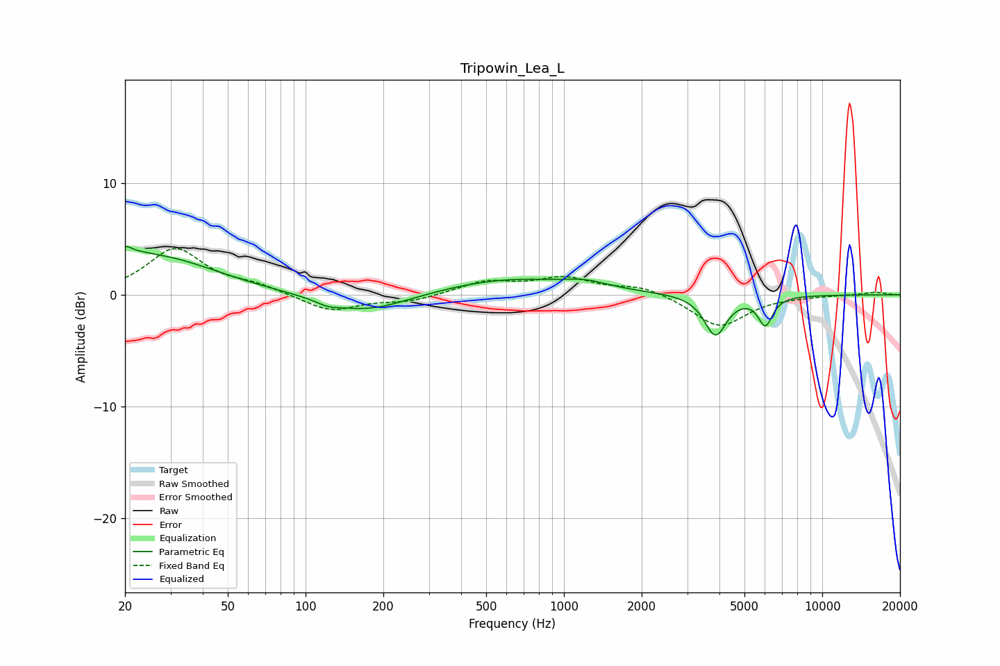

# Tripowin_Lea_L
See [usage instructions](https://github.com/jaakkopasanen/AutoEq#usage) for more options and info.

### Parametric EQs
Apply preamp of -4.4 dB when using parametric equalizer.

|   # | Type    |   Fc (Hz) |    Q |   Gain (dB) |
|-----|---------|-----------|------|-------------|
|   1 | Peaking |        20 | 5.92 |         2.9 |
|   2 | Peaking |        20 | 5.98 |        -1.9 |
|   3 | Peaking |        22 | 1.92 |         0.7 |
|   4 | Peaking |        27 | 0.63 |         3.1 |
|   5 | Peaking |       122 | 3.37 |        -0.4 |
|   6 | Peaking |       170 | 0.86 |        -1.7 |
|   7 | Peaking |       617 | 0.54 |         1.5 |
|   8 | Peaking |      1218 | 1.72 |         0.5 |
|   9 | Peaking |      3860 | 3.3  |        -3.6 |
|  10 | Peaking |      6023 | 4.98 |        -2.5 |

### Fixed Band EQs
When using fixed band (also called graphic) equalizer, apply preamp of **-4.2 dB** (if available) and set gains manually with these parameters.

|   # | Type    |   Fc (Hz) |    Q |   Gain (dB) |
|-----|---------|-----------|------|-------------|
|   1 | Peaking |        31 | 1.41 |         4.1 |
|   2 | Peaking |        62 | 1.41 |         0.7 |
|   3 | Peaking |       125 | 1.41 |        -1.5 |
|   4 | Peaking |       250 | 1.41 |        -0.6 |
|   5 | Peaking |       500 | 1.41 |         1.1 |
|   6 | Peaking |      1000 | 1.41 |         1.4 |
|   7 | Peaking |      2000 | 1.41 |         0.8 |
|   8 | Peaking |      4000 | 1.41 |        -2.9 |
|   9 | Peaking |      8000 | 1.41 |        -0.1 |
|  10 | Peaking |     16000 | 1.41 |         0.3 |

### Graphs

