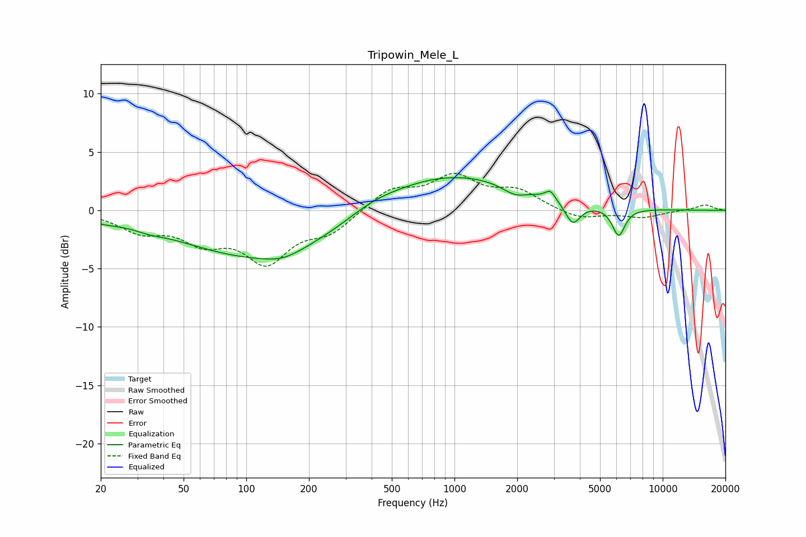

# Tripowin_Mele_L
See [usage instructions](https://github.com/jaakkopasanen/AutoEq#usage) for more options and info.

### Parametric EQs
Apply preamp of -2.9 dB when using parametric equalizer.

|   # | Type    |   Fc (Hz) |    Q |   Gain (dB) |
|-----|---------|-----------|------|-------------|
|   1 | Peaking |        20 | 1.52 |        -0.4 |
|   2 | Peaking |        34 | 2.24 |        -0.3 |
|   3 | Peaking |       123 | 0.35 |        -4.2 |
|   4 | Peaking |       150 | 1.57 |        -0.6 |
|   5 | Peaking |       399 | 1.22 |         0.5 |
|   6 | Peaking |       898 | 0.39 |         3.3 |
|   7 | Peaking |      1940 | 2.44 |        -0.7 |
|   8 | Peaking |      2886 | 5.83 |         0.8 |
|   9 | Peaking |      3699 | 3.85 |        -1.9 |
|  10 | Peaking |      6144 | 4.48 |        -2.4 |

### Fixed Band EQs
When using fixed band (also called graphic) equalizer, apply preamp of **-3.3 dB** (if available) and set gains manually with these parameters.

|   # | Type    |   Fc (Hz) |    Q |   Gain (dB) |
|-----|---------|-----------|------|-------------|
|   1 | Peaking |        31 | 1.41 |        -1.6 |
|   2 | Peaking |        62 | 1.41 |        -2.3 |
|   3 | Peaking |       125 | 1.41 |        -4.1 |
|   4 | Peaking |       250 | 1.41 |        -1.7 |
|   5 | Peaking |       500 | 1.41 |         1.8 |
|   6 | Peaking |      1000 | 1.41 |         2.7 |
|   7 | Peaking |      2000 | 1.41 |         1.5 |
|   8 | Peaking |      4000 | 1.41 |        -0.8 |
|   9 | Peaking |      8000 | 1.41 |        -0.6 |
|  10 | Peaking |     16000 | 1.41 |         0.5 |

### Graphs

