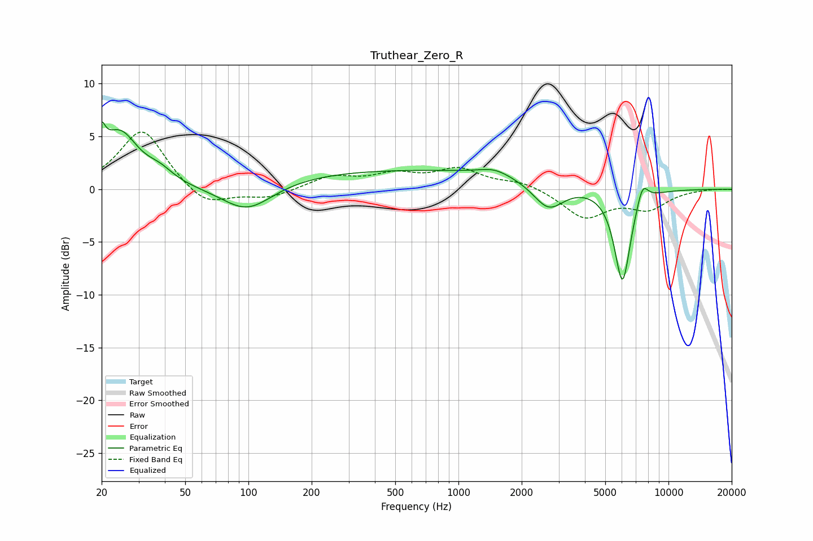

# Truthear_Zero_R
See [usage instructions](https://github.com/jaakkopasanen/AutoEq#usage) for more options and info.

### Parametric EQs
Apply preamp of -6.5 dB when using parametric equalizer.

|   # | Type    |   Fc (Hz) |    Q |   Gain (dB) |
|-----|---------|-----------|------|-------------|
|   1 | Peaking |        20 | 6    |         5.6 |
|   2 | Peaking |        20 | 5.99 |        -2.7 |
|   3 | Peaking |        24 | 1.65 |         5   |
|   4 | Peaking |        38 | 2.16 |         1   |
|   5 | Peaking |        99 | 1.16 |        -2.7 |
|   6 | Peaking |       597 | 0.19 |         1.8 |
|   7 | Peaking |      1484 | 1.92 |         0.6 |
|   8 | Peaking |      2683 | 1.9  |        -2.7 |
|   9 | Peaking |      6039 | 3.52 |        -9   |
|  10 | Peaking |      7518 | 4.95 |         2   |

### Fixed Band EQs
When using fixed band (also called graphic) equalizer, apply preamp of **-5.5 dB** (if available) and set gains manually with these parameters.

|   # | Type    |   Fc (Hz) |    Q |   Gain (dB) |
|-----|---------|-----------|------|-------------|
|   1 | Peaking |        31 | 1.41 |         5.8 |
|   2 | Peaking |        62 | 1.41 |        -1.8 |
|   3 | Peaking |       125 | 1.41 |        -0.8 |
|   4 | Peaking |       250 | 1.41 |         1.2 |
|   5 | Peaking |       500 | 1.41 |         1.2 |
|   6 | Peaking |      1000 | 1.41 |         1.8 |
|   7 | Peaking |      2000 | 1.41 |         0.7 |
|   8 | Peaking |      4000 | 1.41 |        -2.7 |
|   9 | Peaking |      8000 | 1.41 |        -1.7 |
|  10 | Peaking |     16000 | 1.41 |         0.1 |

### Graphs

