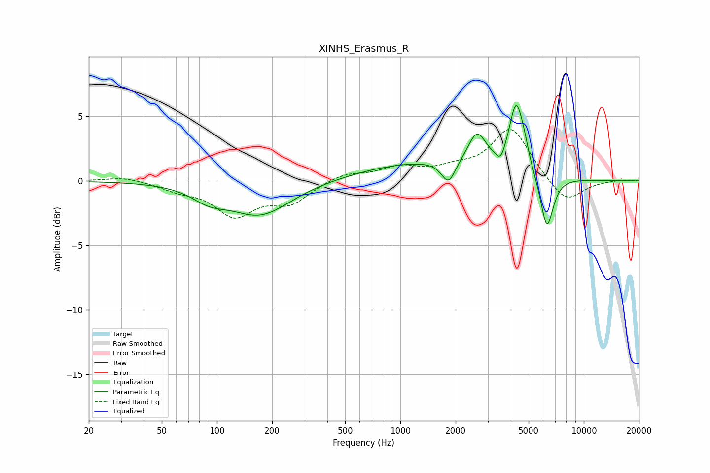

# XINHS_Erasmus_R
See [usage instructions](https://github.com/jaakkopasanen/AutoEq#usage) for more options and info.

### Parametric EQs
Apply preamp of -5.9 dB when using parametric equalizer.

|   # | Type    |   Fc (Hz) |    Q |   Gain (dB) |
|-----|---------|-----------|------|-------------|
|   1 | Peaking |        90 | 1.53 |        -0.9 |
|   2 | Peaking |       172 | 0.85 |        -2.6 |
|   3 | Peaking |       779 | 0.55 |         0.4 |
|   4 | Peaking |      1706 | 0.45 |         1.2 |
|   5 | Peaking |      1830 | 3.72 |        -1.8 |
|   6 | Peaking |      2620 | 2.88 |         2.5 |
|   7 | Peaking |      3523 | 6    |        -0.9 |
|   8 | Peaking |      4284 | 3.62 |         5.2 |
|   9 | Peaking |      4747 | 5.98 |         0.7 |
|  10 | Peaking |      6291 | 3.92 |        -4.2 |

### Fixed Band EQs
When using fixed band (also called graphic) equalizer, apply preamp of **-4.1 dB** (if available) and set gains manually with these parameters.

|   # | Type    |   Fc (Hz) |    Q |   Gain (dB) |
|-----|---------|-----------|------|-------------|
|   1 | Peaking |        31 | 1.41 |         0.4 |
|   2 | Peaking |        62 | 1.41 |        -0.6 |
|   3 | Peaking |       125 | 1.41 |        -2.5 |
|   4 | Peaking |       250 | 1.41 |        -1.6 |
|   5 | Peaking |       500 | 1.41 |         0.6 |
|   6 | Peaking |      1000 | 1.41 |         1   |
|   7 | Peaking |      2000 | 1.41 |         0.7 |
|   8 | Peaking |      4000 | 1.41 |         4.1 |
|   9 | Peaking |      8000 | 1.41 |        -1.8 |
|  10 | Peaking |     16000 | 1.41 |         0.1 |

### Graphs

