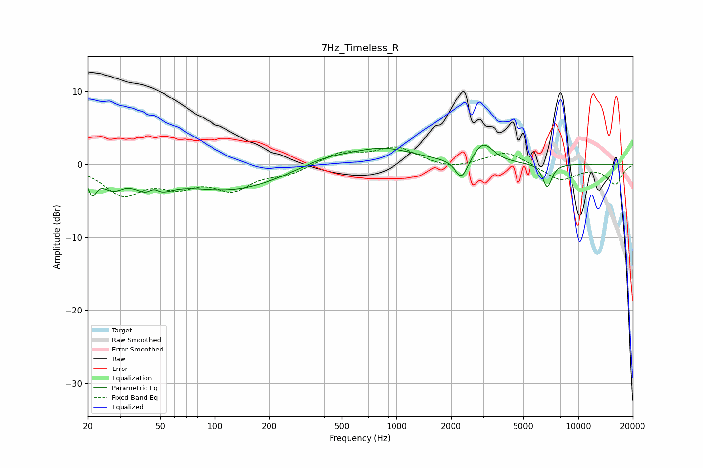

# 7Hz_Timeless_R
See [usage instructions](https://github.com/jaakkopasanen/AutoEq#usage) for more options and info.

### Parametric EQs
Apply preamp of -2.7 dB when using parametric equalizer.

|   # | Type    |   Fc (Hz) |    Q |   Gain (dB) |
|-----|---------|-----------|------|-------------|
|   1 | Peaking |        21 | 5.93 |        -2.8 |
|   2 | Peaking |        27 | 2.49 |        -2.2 |
|   3 | Peaking |        45 | 1.96 |        -3.6 |
|   4 | Peaking |        46 | 4.13 |         1.9 |
|   5 | Peaking |       124 | 0.49 |        -3.5 |
|   6 | Peaking |       402 | 0.95 |         1.1 |
|   7 | Peaking |       845 | 0.79 |         2.1 |
|   8 | Peaking |      2287 | 4.07 |        -2.9 |
|   9 | Peaking |      2999 | 2.54 |         2.8 |
|  10 | Peaking |      6769 | 5.52 |        -3.2 |

### Fixed Band EQs
When using fixed band (also called graphic) equalizer, apply preamp of **-2.5 dB** (if available) and set gains manually with these parameters.

|   # | Type    |   Fc (Hz) |    Q |   Gain (dB) |
|-----|---------|-----------|------|-------------|
|   1 | Peaking |        31 | 1.41 |        -3.9 |
|   2 | Peaking |        62 | 1.41 |        -2.4 |
|   3 | Peaking |       125 | 1.41 |        -3.1 |
|   4 | Peaking |       250 | 1.41 |        -1.2 |
|   5 | Peaking |       500 | 1.41 |         1.6 |
|   6 | Peaking |      1000 | 1.41 |         2.2 |
|   7 | Peaking |      2000 | 1.41 |        -0.7 |
|   8 | Peaking |      4000 | 1.41 |         1.9 |
|   9 | Peaking |      8000 | 1.41 |        -2.2 |
|  10 | Peaking |     16000 | 1.41 |        -2.7 |

### Graphs

