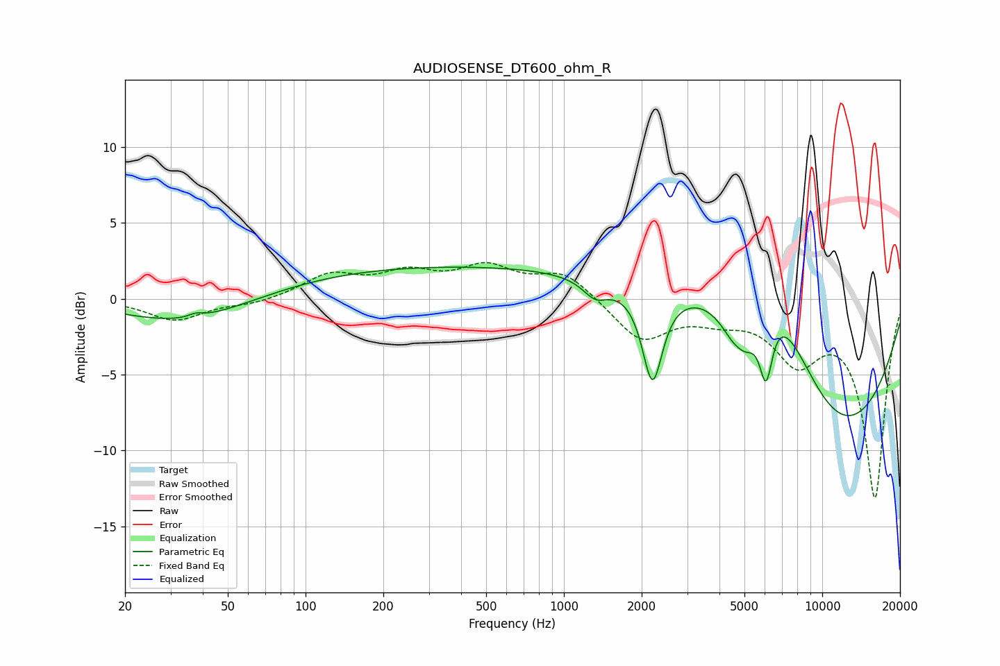

# AUDIOSENSE_DT600_ohm_R
See [usage instructions](https://github.com/jaakkopasanen/AutoEq#usage) for more options and info.

### Parametric EQs
Apply preamp of -2.2 dB when using parametric equalizer.

|   # | Type    |   Fc (Hz) |    Q |   Gain (dB) |
|-----|---------|-----------|------|-------------|
|   1 | Peaking |        34 | 0.58 |        -1.7 |
|   2 | Peaking |        38 | 5.28 |         0.3 |
|   3 | Peaking |       386 | 0.18 |         2.2 |
|   4 | Peaking |      1326 | 2.89 |        -1.2 |
|   5 | Peaking |      2202 | 3.62 |        -6.2 |
|   6 | Peaking |      4761 | 6    |         0.2 |
|   7 | Peaking |      4877 | 1.89 |        -5.1 |
|   8 | Peaking |      6060 | 5.32 |        -4.3 |
|   9 | Peaking |      6158 | 0.61 |        11.4 |
|  10 | Peaking |     10000 | 0.36 |       -12.7 |

### Fixed Band EQs
When using fixed band (also called graphic) equalizer, apply preamp of **-2.5 dB** (if available) and set gains manually with these parameters.

|   # | Type    |   Fc (Hz) |    Q |   Gain (dB) |
|-----|---------|-----------|------|-------------|
|   1 | Peaking |        31 | 1.41 |        -1.4 |
|   2 | Peaking |        62 | 1.41 |        -0.3 |
|   3 | Peaking |       125 | 1.41 |         1.5 |
|   4 | Peaking |       250 | 1.41 |         1.5 |
|   5 | Peaking |       500 | 1.41 |         1.9 |
|   6 | Peaking |      1000 | 1.41 |         1.7 |
|   7 | Peaking |      2000 | 1.41 |        -2.7 |
|   8 | Peaking |      4000 | 1.41 |        -0.9 |
|   9 | Peaking |      8000 | 1.41 |        -3.6 |
|  10 | Peaking |     16000 | 1.41 |       -13   |

### Graphs

