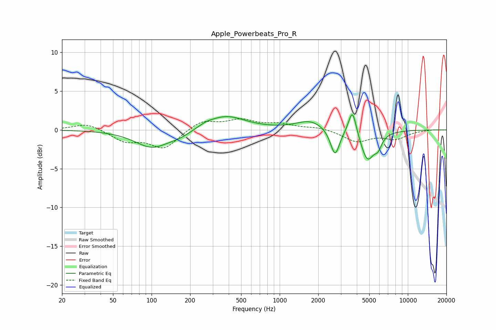

# Apple_Powerbeats_Pro_R
See [usage instructions](https://github.com/jaakkopasanen/AutoEq#usage) for more options and info.

### Parametric EQs
Apply preamp of -2.0 dB when using parametric equalizer.

|   # | Type    |   Fc (Hz) |    Q |   Gain (dB) |
|-----|---------|-----------|------|-------------|
|   1 | Peaking |       101 | 1.06 |        -2.2 |
|   2 | Peaking |       167 | 1.56 |        -0.6 |
|   3 | Peaking |       266 | 2.57 |         0.3 |
|   4 | Peaking |       378 | 0.94 |         1.8 |
|   5 | Peaking |      1741 | 1.29 |         1.2 |
|   6 | Peaking |      2654 | 3.42 |        -0.5 |
|   7 | Peaking |      2709 | 4.12 |        -3   |
|   8 | Peaking |      3697 | 4.68 |         3.4 |
|   9 | Peaking |      4841 | 2.66 |        -3.9 |
|  10 | Peaking |      5864 | 4.8  |        -1.3 |

### Fixed Band EQs
When using fixed band (also called graphic) equalizer, apply preamp of **-1.5 dB** (if available) and set gains manually with these parameters.

|   # | Type    |   Fc (Hz) |    Q |   Gain (dB) |
|-----|---------|-----------|------|-------------|
|   1 | Peaking |        31 | 1.41 |         0.9 |
|   2 | Peaking |        62 | 1.41 |        -1.4 |
|   3 | Peaking |       125 | 1.41 |        -2.3 |
|   4 | Peaking |       250 | 1.41 |         1.2 |
|   5 | Peaking |       500 | 1.41 |         1.2 |
|   6 | Peaking |      1000 | 1.41 |         0.7 |
|   7 | Peaking |      2000 | 1.41 |         0.3 |
|   8 | Peaking |      4000 | 1.41 |        -1.5 |
|   9 | Peaking |      8000 | 1.41 |        -1.1 |
|  10 | Peaking |     16000 | 1.41 |         0.1 |

### Graphs

