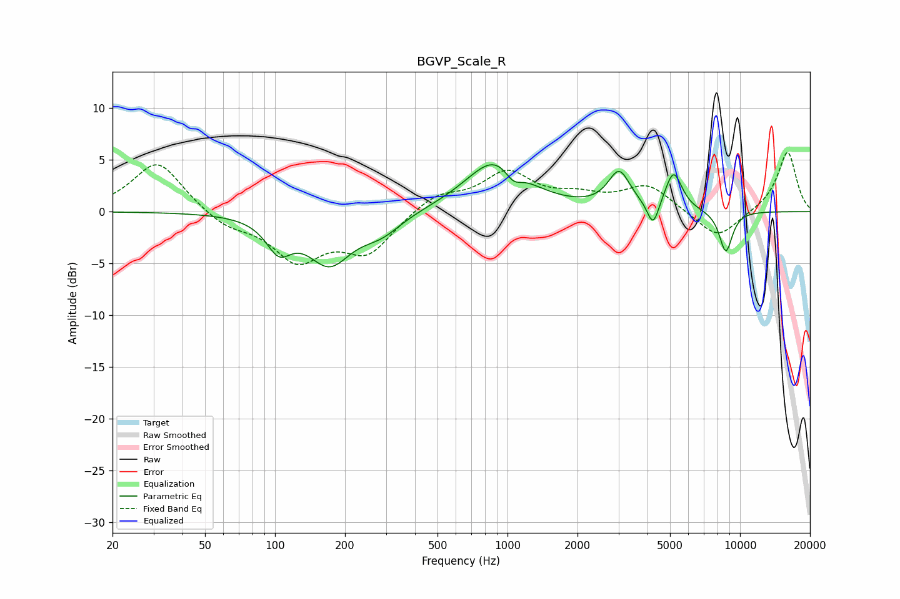

# BGVP_Scale_R
See [usage instructions](https://github.com/jaakkopasanen/AutoEq#usage) for more options and info.

### Parametric EQs
Apply preamp of -4.6 dB when using parametric equalizer.

|   # | Type    |   Fc (Hz) |    Q |   Gain (dB) |
|-----|---------|-----------|------|-------------|
|   1 | Peaking |       104 | 2.61 |        -2.9 |
|   2 | Peaking |       171 | 1.5  |        -4.7 |
|   3 | Peaking |       286 | 1.57 |        -1.7 |
|   4 | Peaking |       892 | 1.11 |         5.1 |
|   5 | Peaking |      1058 | 3.82 |        -1.4 |
|   6 | Peaking |      3021 | 3.01 |         3.5 |
|   7 | Peaking |      4230 | 5.61 |        -2.5 |
|   8 | Peaking |      5177 | 3.85 |         3.7 |
|   9 | Peaking |      8676 | 4.59 |        -3.3 |
|  10 | Peaking |      8783 | 4.03 |        -0.7 |

### Fixed Band EQs
When using fixed band (also called graphic) equalizer, apply preamp of **-5.8 dB** (if available) and set gains manually with these parameters.

|   # | Type    |   Fc (Hz) |    Q |   Gain (dB) |
|-----|---------|-----------|------|-------------|
|   1 | Peaking |        31 | 1.41 |         4.9 |
|   2 | Peaking |        62 | 1.41 |        -1.4 |
|   3 | Peaking |       125 | 1.41 |        -4.4 |
|   4 | Peaking |       250 | 1.41 |        -3.8 |
|   5 | Peaking |       500 | 1.41 |         1.7 |
|   6 | Peaking |      1000 | 1.41 |         3.6 |
|   7 | Peaking |      2000 | 1.41 |         1.2 |
|   8 | Peaking |      4000 | 1.41 |         2.5 |
|   9 | Peaking |      8000 | 1.41 |        -2.8 |
|  10 | Peaking |     16000 | 1.41 |         5.8 |

### Graphs

