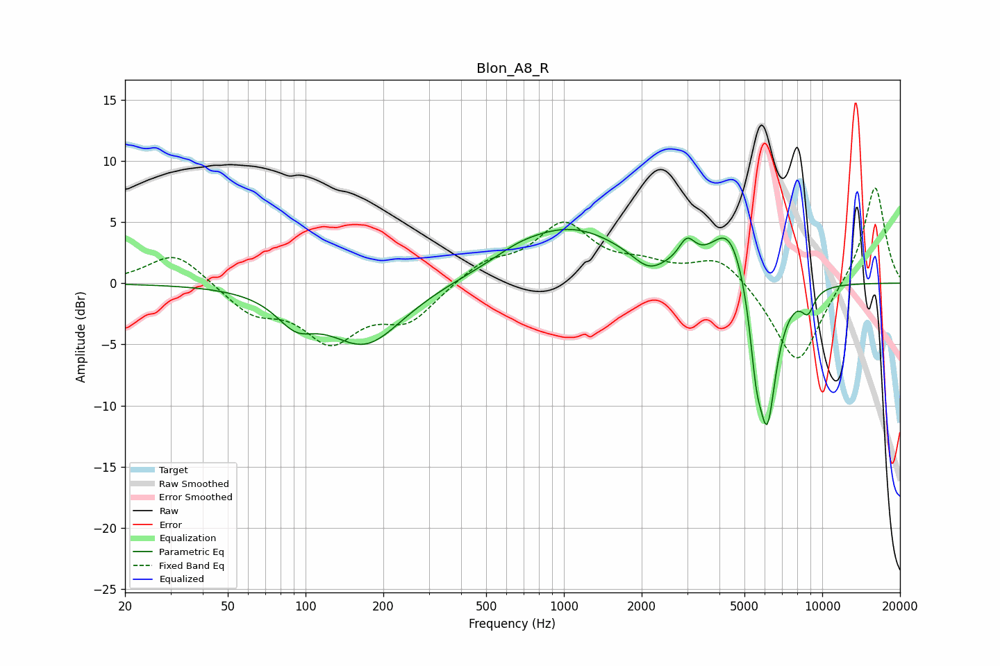

# Blon_A8_R
See [usage instructions](https://github.com/jaakkopasanen/AutoEq#usage) for more options and info.

### Parametric EQs
Apply preamp of -4.5 dB when using parametric equalizer.

|   # | Type    |   Fc (Hz) |    Q |   Gain (dB) |
|-----|---------|-----------|------|-------------|
|   1 | Peaking |        92 | 1.9  |        -2.2 |
|   2 | Peaking |       171 | 0.96 |        -5   |
|   3 | Peaking |       662 | 1.49 |         0.5 |
|   4 | Peaking |      1061 | 0.64 |         4.4 |
|   5 | Peaking |      2123 | 2.36 |        -1.3 |
|   6 | Peaking |      2994 | 4.41 |         1.8 |
|   7 | Peaking |      4392 | 1.91 |         4.9 |
|   8 | Peaking |      5545 | 5.96 |        -4.2 |
|   9 | Peaking |      6121 | 3.54 |       -11.8 |
|  10 | Peaking |      8794 | 5.12 |        -1.7 |

### Fixed Band EQs
When using fixed band (also called graphic) equalizer, apply preamp of **-7.9 dB** (if available) and set gains manually with these parameters.

|   # | Type    |   Fc (Hz) |    Q |   Gain (dB) |
|-----|---------|-----------|------|-------------|
|   1 | Peaking |        31 | 1.41 |         2.6 |
|   2 | Peaking |        62 | 1.41 |        -2.2 |
|   3 | Peaking |       125 | 1.41 |        -4.4 |
|   4 | Peaking |       250 | 1.41 |        -2.8 |
|   5 | Peaking |       500 | 1.41 |         1.6 |
|   6 | Peaking |      1000 | 1.41 |         4.6 |
|   7 | Peaking |      2000 | 1.41 |         1.2 |
|   8 | Peaking |      4000 | 1.41 |         2.3 |
|   9 | Peaking |      8000 | 1.41 |        -7   |
|  10 | Peaking |     16000 | 1.41 |         8.2 |

### Graphs

