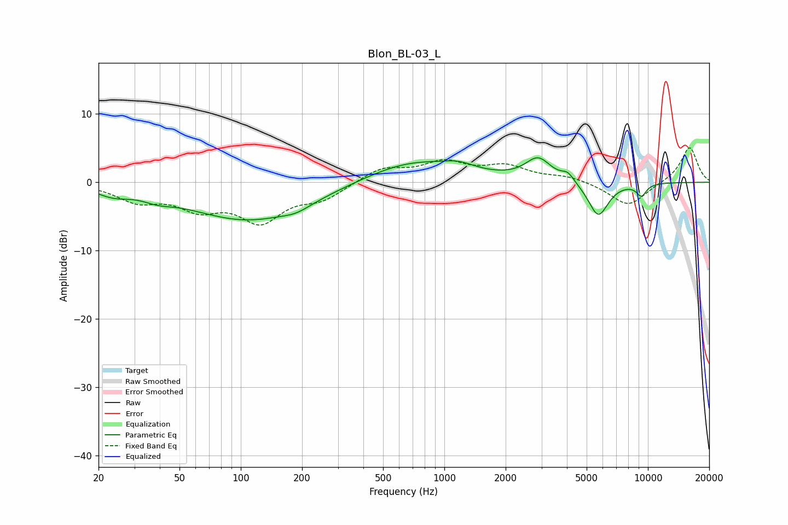

# Blon_BL-03_L
See [usage instructions](https://github.com/jaakkopasanen/AutoEq#usage) for more options and info.

### Parametric EQs
Apply preamp of -3.7 dB when using parametric equalizer.

|   # | Type    |   Fc (Hz) |    Q |   Gain (dB) |
|-----|---------|-----------|------|-------------|
|   1 | Peaking |        24 | 1.81 |        -1.1 |
|   2 | Peaking |        39 | 2.09 |        -0.8 |
|   3 | Peaking |       110 | 0.47 |        -5.6 |
|   4 | Peaking |       188 | 2.11 |        -0.7 |
|   5 | Peaking |       700 | 0.59 |         3.2 |
|   6 | Peaking |      1181 | 1.87 |         0.9 |
|   7 | Peaking |      2892 | 2.26 |         3.2 |
|   8 | Peaking |      4045 | 4.55 |         1.2 |
|   9 | Peaking |      5704 | 2.78 |        -5.1 |
|  10 | Peaking |      9292 | 5.11 |        -1.8 |

### Fixed Band EQs
When using fixed band (also called graphic) equalizer, apply preamp of **-5.1 dB** (if available) and set gains manually with these parameters.

|   # | Type    |   Fc (Hz) |    Q |   Gain (dB) |
|-----|---------|-----------|------|-------------|
|   1 | Peaking |        31 | 1.41 |        -2.5 |
|   2 | Peaking |        62 | 1.41 |        -3.2 |
|   3 | Peaking |       125 | 1.41 |        -5.3 |
|   4 | Peaking |       250 | 1.41 |        -2.2 |
|   5 | Peaking |       500 | 1.41 |         2.1 |
|   6 | Peaking |      1000 | 1.41 |         2.7 |
|   7 | Peaking |      2000 | 1.41 |         2.1 |
|   8 | Peaking |      4000 | 1.41 |         0.8 |
|   9 | Peaking |      8000 | 1.41 |        -3.6 |
|  10 | Peaking |     16000 | 1.41 |         5.2 |

### Graphs

