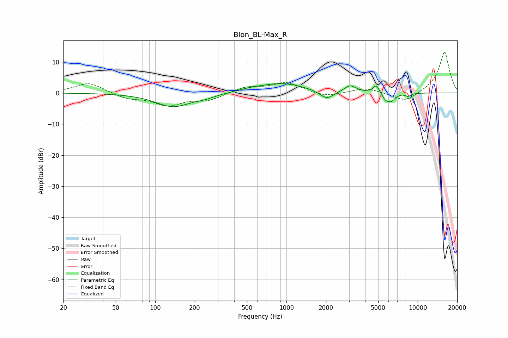

# Blon_BL-Max_R
See [usage instructions](https://github.com/jaakkopasanen/AutoEq#usage) for more options and info.

### Parametric EQs
Apply preamp of -3.1 dB when using parametric equalizer.

|   # | Type    |   Fc (Hz) |    Q |   Gain (dB) |
|-----|---------|-----------|------|-------------|
|   1 | Peaking |       137 | 1.06 |        -4.4 |
|   2 | Peaking |       240 | 1.84 |        -0.9 |
|   3 | Peaking |       519 | 1.54 |         0.5 |
|   4 | Peaking |       920 | 0.81 |         3.1 |
|   5 | Peaking |      2028 | 2.74 |        -2.7 |
|   6 | Peaking |      3061 | 3.17 |         2.2 |
|   7 | Peaking |      4836 | 5.95 |         2.6 |
|   8 | Peaking |      5658 | 6    |        -1.6 |
|   9 | Peaking |      6258 | 4.29 |        -2.5 |
|  10 | Peaking |      8457 | 6    |        -0.9 |

### Fixed Band EQs
When using fixed band (also called graphic) equalizer, apply preamp of **-13.2 dB** (if available) and set gains manually with these parameters.

|   # | Type    |   Fc (Hz) |    Q |   Gain (dB) |
|-----|---------|-----------|------|-------------|
|   1 | Peaking |        31 | 1.41 |         3.4 |
|   2 | Peaking |        62 | 1.41 |        -1.7 |
|   3 | Peaking |       125 | 1.41 |        -3.7 |
|   4 | Peaking |       250 | 1.41 |        -2.2 |
|   5 | Peaking |       500 | 1.41 |         1.9 |
|   6 | Peaking |      1000 | 1.41 |         3.3 |
|   7 | Peaking |      2000 | 1.41 |        -1.4 |
|   8 | Peaking |      4000 | 1.41 |         1.6 |
|   9 | Peaking |      8000 | 1.41 |        -3.1 |
|  10 | Peaking |     16000 | 1.41 |        13.3 |

### Graphs

