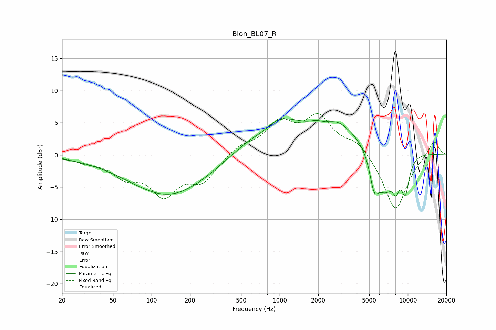

# Blon_BL07_R
See [usage instructions](https://github.com/jaakkopasanen/AutoEq#usage) for more options and info.

### Parametric EQs
Apply preamp of -5.7 dB when using parametric equalizer.

|   # | Type    |   Fc (Hz) |    Q |   Gain (dB) |
|-----|---------|-----------|------|-------------|
|   1 | Peaking |       139 | 0.44 |        -6.4 |
|   2 | Peaking |       738 | 1.68 |        -1.2 |
|   3 | Peaking |       909 | 0.66 |         6   |
|   4 | Peaking |      1934 | 2.75 |         0.6 |
|   5 | Peaking |      2840 | 1.64 |         1.5 |
|   6 | Peaking |      4415 | 0.47 |         3.9 |
|   7 | Peaking |      5451 | 4.11 |        -4.3 |
|   8 | Peaking |      6598 | 1.43 |        -7.8 |
|   9 | Peaking |      8086 | 5.34 |        -2.5 |
|  10 | Peaking |      9564 | 3.94 |        -5.2 |

### Fixed Band EQs
When using fixed band (also called graphic) equalizer, apply preamp of **-6.5 dB** (if available) and set gains manually with these parameters.

|   # | Type    |   Fc (Hz) |    Q |   Gain (dB) |
|-----|---------|-----------|------|-------------|
|   1 | Peaking |        31 | 1.41 |        -0.8 |
|   2 | Peaking |        62 | 1.41 |        -2.9 |
|   3 | Peaking |       125 | 1.41 |        -5.7 |
|   4 | Peaking |       250 | 1.41 |        -3.7 |
|   5 | Peaking |       500 | 1.41 |         1.4 |
|   6 | Peaking |      1000 | 1.41 |         4.6 |
|   7 | Peaking |      2000 | 1.41 |         5.5 |
|   8 | Peaking |      4000 | 1.41 |         2.1 |
|   9 | Peaking |      8000 | 1.41 |        -8.8 |
|  10 | Peaking |     16000 | 1.41 |         2.4 |

### Graphs

