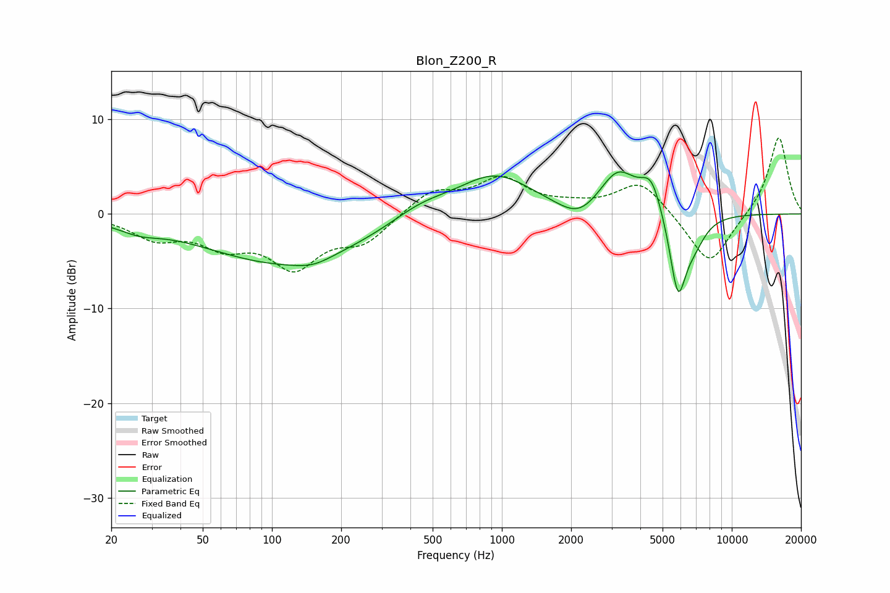

# Blon_Z200_R
See [usage instructions](https://github.com/jaakkopasanen/AutoEq#usage) for more options and info.

### Parametric EQs
Apply preamp of -4.5 dB when using parametric equalizer.

|   # | Type    |   Fc (Hz) |    Q |   Gain (dB) |
|-----|---------|-----------|------|-------------|
|   1 | Peaking |        26 | 1.56 |        -0.9 |
|   2 | Peaking |       114 | 0.4  |        -5.2 |
|   3 | Peaking |       151 | 1.79 |        -0.7 |
|   4 | Peaking |       442 | 1.08 |         1.4 |
|   5 | Peaking |       932 | 0.86 |         4.2 |
|   6 | Peaking |      2161 | 1.59 |        -2   |
|   7 | Peaking |      3193 | 1.73 |         4.4 |
|   8 | Peaking |      4469 | 2.94 |         3.5 |
|   9 | Peaking |      5833 | 3.7  |        -8.6 |
|  10 | Peaking |      6869 | 2.62 |        -2.2 |

### Fixed Band EQs
When using fixed band (also called graphic) equalizer, apply preamp of **-8.1 dB** (if available) and set gains manually with these parameters.

|   # | Type    |   Fc (Hz) |    Q |   Gain (dB) |
|-----|---------|-----------|------|-------------|
|   1 | Peaking |        31 | 1.41 |        -2.3 |
|   2 | Peaking |        62 | 1.41 |        -2.8 |
|   3 | Peaking |       125 | 1.41 |        -5.2 |
|   4 | Peaking |       250 | 1.41 |        -2.7 |
|   5 | Peaking |       500 | 1.41 |         2.4 |
|   6 | Peaking |      1000 | 1.41 |         3.5 |
|   7 | Peaking |      2000 | 1.41 |         0.6 |
|   8 | Peaking |      4000 | 1.41 |         3.5 |
|   9 | Peaking |      8000 | 1.41 |        -5.7 |
|  10 | Peaking |     16000 | 1.41 |         8.3 |

### Graphs

