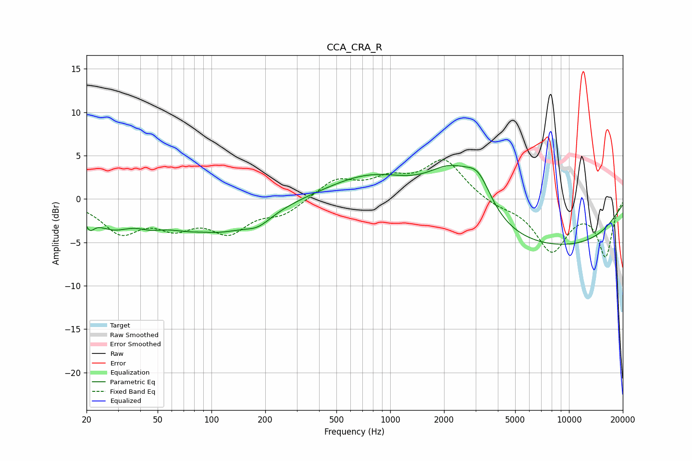

# CCA_CRA_R
See [usage instructions](https://github.com/jaakkopasanen/AutoEq#usage) for more options and info.

### Parametric EQs
Apply preamp of -4.0 dB when using parametric equalizer.

|   # | Type    |   Fc (Hz) |    Q |   Gain (dB) |
|-----|---------|-----------|------|-------------|
|   1 | Peaking |        21 | 5.46 |        -1.5 |
|   2 | Peaking |        28 | 1.36 |        -2.3 |
|   3 | Peaking |        46 | 2.2  |        -0.7 |
|   4 | Peaking |        90 | 2.16 |         0.3 |
|   5 | Peaking |        96 | 0.55 |        -3.9 |
|   6 | Peaking |       182 | 1.93 |        -1.1 |
|   7 | Peaking |       825 | 0.57 |         3.5 |
|   8 | Peaking |      2203 | 0.95 |         5.8 |
|   9 | Peaking |      3115 | 1.91 |         3.7 |
|  10 | Peaking |      6366 | 0.2  |        -5.9 |

### Fixed Band EQs
When using fixed band (also called graphic) equalizer, apply preamp of **-4.6 dB** (if available) and set gains manually with these parameters.

|   # | Type    |   Fc (Hz) |    Q |   Gain (dB) |
|-----|---------|-----------|------|-------------|
|   1 | Peaking |        31 | 1.41 |        -3.6 |
|   2 | Peaking |        62 | 1.41 |        -2.6 |
|   3 | Peaking |       125 | 1.41 |        -3.4 |
|   4 | Peaking |       250 | 1.41 |        -1.6 |
|   5 | Peaking |       500 | 1.41 |         2.2 |
|   6 | Peaking |      1000 | 1.41 |         1.9 |
|   7 | Peaking |      2000 | 1.41 |         4.4 |
|   8 | Peaking |      4000 | 1.41 |        -0.7 |
|   9 | Peaking |      8000 | 1.41 |        -5.8 |
|  10 | Peaking |     16000 | 1.41 |        -6.4 |

### Graphs

