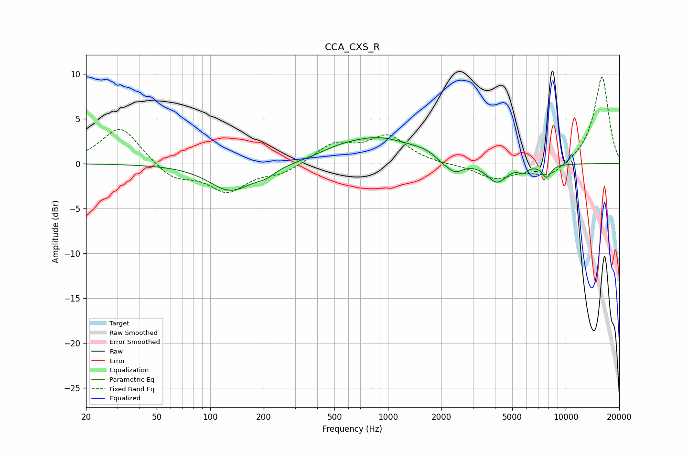

# CCA_CXS_R
See [usage instructions](https://github.com/jaakkopasanen/AutoEq#usage) for more options and info.

### Parametric EQs
Apply preamp of -3.0 dB when using parametric equalizer.

|   # | Type    |   Fc (Hz) |    Q |   Gain (dB) |
|-----|---------|-----------|------|-------------|
|   1 | Peaking |       130 | 1.17 |        -3   |
|   2 | Peaking |       205 | 2.41 |        -0.7 |
|   3 | Peaking |       525 | 1.35 |         0.5 |
|   4 | Peaking |       880 | 0.71 |         2.8 |
|   5 | Peaking |      1575 | 1.87 |         0.4 |
|   6 | Peaking |      2007 | 4.39 |        -0.3 |
|   7 | Peaking |      2376 | 2.93 |        -1.4 |
|   8 | Peaking |      4103 | 2.48 |        -2.2 |
|   9 | Peaking |      5751 | 5.91 |        -0.7 |
|  10 | Peaking |      7807 | 5.25 |        -1.4 |

### Fixed Band EQs
When using fixed band (also called graphic) equalizer, apply preamp of **-9.7 dB** (if available) and set gains manually with these parameters.

|   # | Type    |   Fc (Hz) |    Q |   Gain (dB) |
|-----|---------|-----------|------|-------------|
|   1 | Peaking |        31 | 1.41 |         4.2 |
|   2 | Peaking |        62 | 1.41 |        -1.7 |
|   3 | Peaking |       125 | 1.41 |        -3   |
|   4 | Peaking |       250 | 1.41 |        -1   |
|   5 | Peaking |       500 | 1.41 |         2.1 |
|   6 | Peaking |      1000 | 1.41 |         2.9 |
|   7 | Peaking |      2000 | 1.41 |        -0.1 |
|   8 | Peaking |      4000 | 1.41 |        -1.7 |
|   9 | Peaking |      8000 | 1.41 |        -1.5 |
|  10 | Peaking |     16000 | 1.41 |         9.8 |

### Graphs

