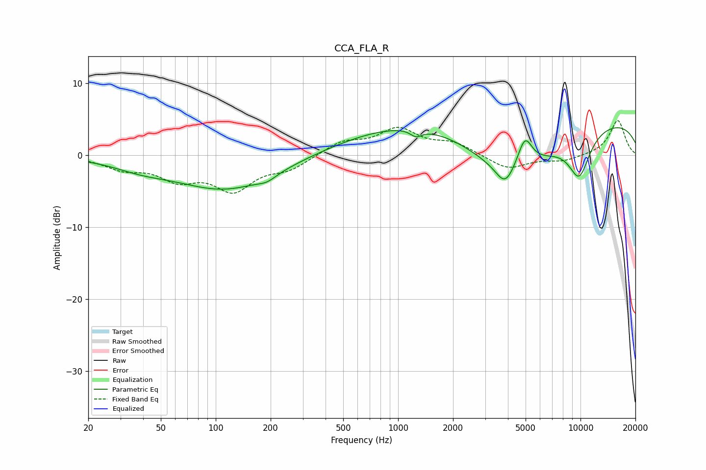

# CCA_FLA_R
See [usage instructions](https://github.com/jaakkopasanen/AutoEq#usage) for more options and info.

### Parametric EQs
Apply preamp of -3.9 dB when using parametric equalizer.

|   # | Type    |   Fc (Hz) |    Q |   Gain (dB) |
|-----|---------|-----------|------|-------------|
|   1 | Peaking |        39 | 0.91 |        -1.1 |
|   2 | Peaking |       114 | 0.52 |        -4.7 |
|   3 | Peaking |       191 | 2.8  |        -0.7 |
|   4 | Peaking |      1252 | 0.37 |         4.4 |
|   5 | Peaking |      1255 | 4.57 |        -1   |
|   6 | Peaking |      3859 | 2.9  |        -2.7 |
|   7 | Peaking |      4108 | 0.57 |        -7.7 |
|   8 | Peaking |      4957 | 3.4  |         4.3 |
|   9 | Peaking |      9838 | 2.03 |        -5.9 |
|  10 | Peaking |     10000 | 0.18 |         5.3 |

### Fixed Band EQs
When using fixed band (also called graphic) equalizer, apply preamp of **-4.9 dB** (if available) and set gains manually with these parameters.

|   # | Type    |   Fc (Hz) |    Q |   Gain (dB) |
|-----|---------|-----------|------|-------------|
|   1 | Peaking |        31 | 1.41 |        -1.6 |
|   2 | Peaking |        62 | 1.41 |        -2.9 |
|   3 | Peaking |       125 | 1.41 |        -4.5 |
|   4 | Peaking |       250 | 1.41 |        -1.7 |
|   5 | Peaking |       500 | 1.41 |         1.8 |
|   6 | Peaking |      1000 | 1.41 |         3.5 |
|   7 | Peaking |      2000 | 1.41 |         1.6 |
|   8 | Peaking |      4000 | 1.41 |        -2   |
|   9 | Peaking |      8000 | 1.41 |        -0.8 |
|  10 | Peaking |     16000 | 1.41 |         4.9 |

### Graphs

