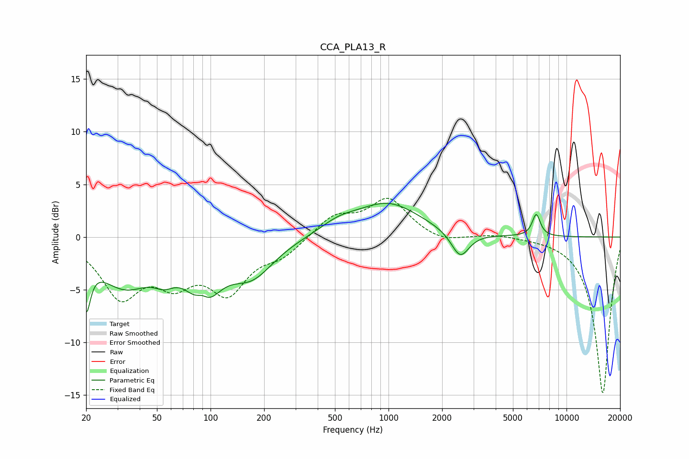

# CCA_PLA13_R
See [usage instructions](https://github.com/jaakkopasanen/AutoEq#usage) for more options and info.

### Parametric EQs
Apply preamp of -3.3 dB when using parametric equalizer.

|   # | Type    |   Fc (Hz) |    Q |   Gain (dB) |
|-----|---------|-----------|------|-------------|
|   1 | Peaking |        20 | 5.97 |        -4.7 |
|   2 | Peaking |        33 | 0.91 |        -4.3 |
|   3 | Peaking |        55 | 2.36 |        -1.3 |
|   4 | Peaking |        90 | 3.41 |         1.9 |
|   5 | Peaking |        91 | 1.74 |        -5.6 |
|   6 | Peaking |       170 | 1.12 |        -3.3 |
|   7 | Peaking |       524 | 1.32 |         0.9 |
|   8 | Peaking |       996 | 0.79 |         3.1 |
|   9 | Peaking |      2527 | 2.82 |        -2.5 |
|  10 | Peaking |      6760 | 6    |         2.1 |

### Fixed Band EQs
When using fixed band (also called graphic) equalizer, apply preamp of **-3.8 dB** (if available) and set gains manually with these parameters.

|   # | Type    |   Fc (Hz) |    Q |   Gain (dB) |
|-----|---------|-----------|------|-------------|
|   1 | Peaking |        31 | 1.41 |        -5.3 |
|   2 | Peaking |        62 | 1.41 |        -3.5 |
|   3 | Peaking |       125 | 1.41 |        -4.7 |
|   4 | Peaking |       250 | 1.41 |        -1.5 |
|   5 | Peaking |       500 | 1.41 |         2   |
|   6 | Peaking |      1000 | 1.41 |         3.5 |
|   7 | Peaking |      2000 | 1.41 |        -0.6 |
|   8 | Peaking |      4000 | 1.41 |         0.3 |
|   9 | Peaking |      8000 | 1.41 |         0   |
|  10 | Peaking |     16000 | 1.41 |       -14.9 |

### Graphs

