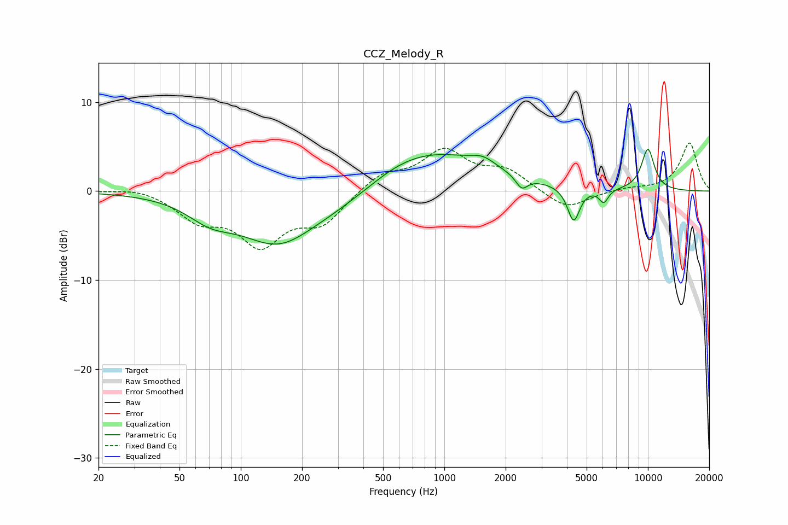

# CCZ_Melody_R
See [usage instructions](https://github.com/jaakkopasanen/AutoEq#usage) for more options and info.

### Parametric EQs
Apply preamp of -4.8 dB when using parametric equalizer.

|   # | Type    |   Fc (Hz) |    Q |   Gain (dB) |
|-----|---------|-----------|------|-------------|
|   1 | Peaking |        71 | 1.25 |        -2   |
|   2 | Peaking |       154 | 0.73 |        -5.9 |
|   3 | Peaking |       288 | 1.04 |        -0.9 |
|   4 | Peaking |       404 | 1.1  |        -0.8 |
|   5 | Peaking |       802 | 0.47 |         4.6 |
|   6 | Peaking |      1548 | 2.3  |         1   |
|   7 | Peaking |      2400 | 4.85 |        -1.4 |
|   8 | Peaking |      4316 | 4.66 |        -3.9 |
|   9 | Peaking |      6067 | 6    |        -1.5 |
|  10 | Peaking |     10000 | 3.72 |         4.7 |

### Fixed Band EQs
When using fixed band (also called graphic) equalizer, apply preamp of **-5.5 dB** (if available) and set gains manually with these parameters.

|   # | Type    |   Fc (Hz) |    Q |   Gain (dB) |
|-----|---------|-----------|------|-------------|
|   1 | Peaking |        31 | 1.41 |         0.5 |
|   2 | Peaking |        62 | 1.41 |        -2.9 |
|   3 | Peaking |       125 | 1.41 |        -5.6 |
|   4 | Peaking |       250 | 1.41 |        -3.3 |
|   5 | Peaking |       500 | 1.41 |         1.9 |
|   6 | Peaking |      1000 | 1.41 |         4.3 |
|   7 | Peaking |      2000 | 1.41 |         2.2 |
|   8 | Peaking |      4000 | 1.41 |        -2.1 |
|   9 | Peaking |      8000 | 1.41 |         0.3 |
|  10 | Peaking |     16000 | 1.41 |         5.4 |

### Graphs

