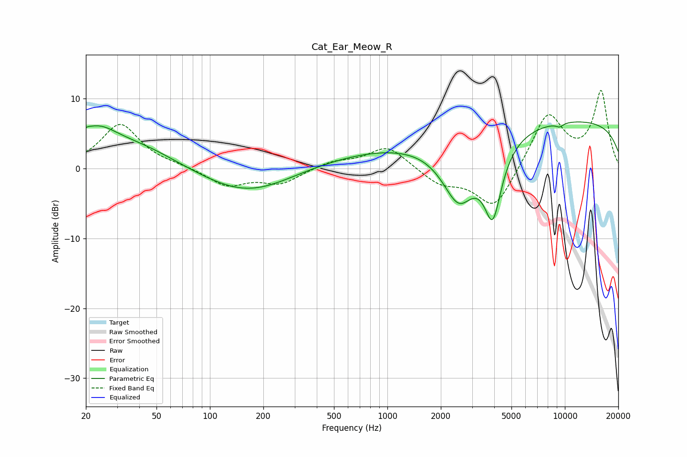

# Cat_Ear_Meow_R
See [usage instructions](https://github.com/jaakkopasanen/AutoEq#usage) for more options and info.

### Parametric EQs
Apply preamp of -6.7 dB when using parametric equalizer.

|   # | Type    |   Fc (Hz) |    Q |   Gain (dB) |
|-----|---------|-----------|------|-------------|
|   1 | Peaking |        20 | 5.89 |         0.6 |
|   2 | Peaking |        23 | 1.18 |         4.4 |
|   3 | Peaking |        41 | 0.64 |         2.9 |
|   4 | Peaking |       166 | 0.55 |        -4   |
|   5 | Peaking |       691 | 0.32 |         1.6 |
|   6 | Peaking |      1123 | 0.47 |         0.8 |
|   7 | Peaking |      2523 | 1.45 |        -8.7 |
|   8 | Peaking |      3924 | 2.71 |       -10.3 |
|   9 | Peaking |      9333 | 5.94 |        -0.5 |
|  10 | Peaking |     10000 | 0.18 |         7   |

### Fixed Band EQs
When using fixed band (also called graphic) equalizer, apply preamp of **-11.2 dB** (if available) and set gains manually with these parameters.

|   # | Type    |   Fc (Hz) |    Q |   Gain (dB) |
|-----|---------|-----------|------|-------------|
|   1 | Peaking |        31 | 1.41 |         6.3 |
|   2 | Peaking |        62 | 1.41 |         0.3 |
|   3 | Peaking |       125 | 1.41 |        -2.5 |
|   4 | Peaking |       250 | 1.41 |        -2.1 |
|   5 | Peaking |       500 | 1.41 |         1   |
|   6 | Peaking |      1000 | 1.41 |         3.2 |
|   7 | Peaking |      2000 | 1.41 |        -2.1 |
|   8 | Peaking |      4000 | 1.41 |        -6   |
|   9 | Peaking |      8000 | 1.41 |         7.9 |
|  10 | Peaking |     16000 | 1.41 |        10.9 |

### Graphs

