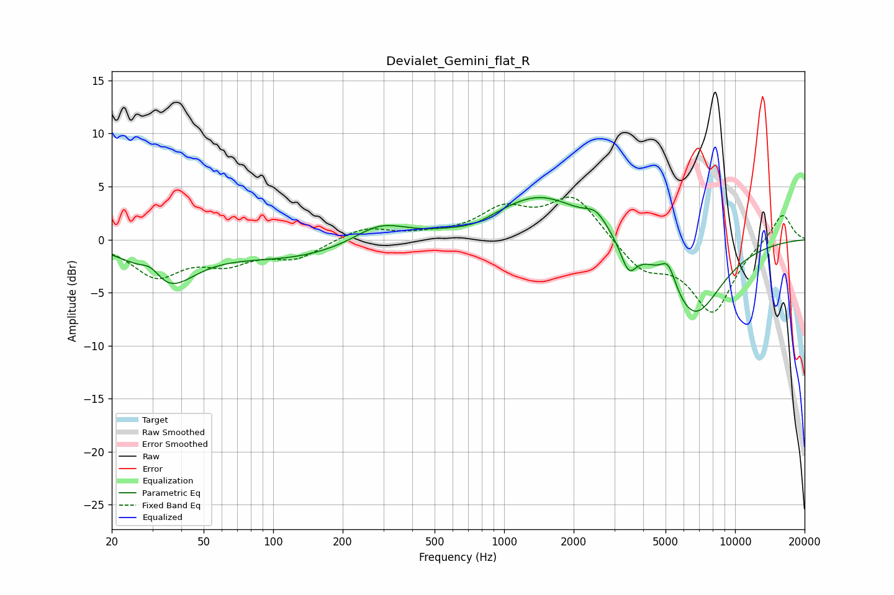

# Devialet_Gemini_flat_R
See [usage instructions](https://github.com/jaakkopasanen/AutoEq#usage) for more options and info.

### Parametric EQs
Apply preamp of -4.1 dB when using parametric equalizer.

|   # | Type    |   Fc (Hz) |    Q |   Gain (dB) |
|-----|---------|-----------|------|-------------|
|   1 | Peaking |        30 | 3.17 |         1.4 |
|   2 | Peaking |        34 | 1.2  |        -4.2 |
|   3 | Peaking |       119 | 0.49 |        -1.7 |
|   4 | Peaking |       290 | 1.24 |         1.9 |
|   5 | Peaking |       742 | 1.86 |        -0.5 |
|   6 | Peaking |      1432 | 0.73 |         4.2 |
|   7 | Peaking |      2507 | 2.88 |         1.4 |
|   8 | Peaking |      3460 | 4.1  |        -2.6 |
|   9 | Peaking |      5136 | 4.21 |         2.2 |
|  10 | Peaking |      6611 | 1.11 |        -7.3 |

### Fixed Band EQs
When using fixed band (also called graphic) equalizer, apply preamp of **-4.1 dB** (if available) and set gains manually with these parameters.

|   # | Type    |   Fc (Hz) |    Q |   Gain (dB) |
|-----|---------|-----------|------|-------------|
|   1 | Peaking |        31 | 1.41 |        -3.3 |
|   2 | Peaking |        62 | 1.41 |        -1.9 |
|   3 | Peaking |       125 | 1.41 |        -1.6 |
|   4 | Peaking |       250 | 1.41 |         1.2 |
|   5 | Peaking |       500 | 1.41 |         0.3 |
|   6 | Peaking |      1000 | 1.41 |         2.6 |
|   7 | Peaking |      2000 | 1.41 |         4.1 |
|   8 | Peaking |      4000 | 1.41 |        -2.7 |
|   9 | Peaking |      8000 | 1.41 |        -6.7 |
|  10 | Peaking |     16000 | 1.41 |         2.6 |

### Graphs

