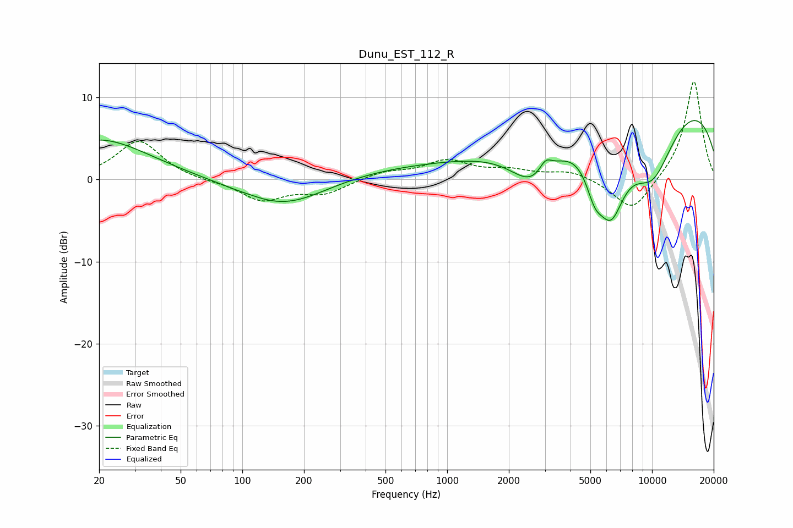

# Dunu_EST_112_R
See [usage instructions](https://github.com/jaakkopasanen/AutoEq#usage) for more options and info.

### Parametric EQs
Apply preamp of -7.3 dB when using parametric equalizer.

|   # | Type    |   Fc (Hz) |    Q |   Gain (dB) |
|-----|---------|-----------|------|-------------|
|   1 | Peaking |        20 | 0.58 |         4.9 |
|   2 | Peaking |       112 | 3.68 |         0.1 |
|   3 | Peaking |       160 | 0.63 |        -4.3 |
|   4 | Peaking |       379 | 0.26 |         1.7 |
|   5 | Peaking |      2626 | 1.22 |        -5.3 |
|   6 | Peaking |      3023 | 4.59 |         1.6 |
|   7 | Peaking |      5247 | 3.19 |        -3.6 |
|   8 | Peaking |      6293 | 1.8  |        -9.6 |
|   9 | Peaking |     10000 | 0.23 |        13.9 |
|  10 | Peaking |     10000 | 0.82 |       -11.9 |

### Fixed Band EQs
When using fixed band (also called graphic) equalizer, apply preamp of **-12.0 dB** (if available) and set gains manually with these parameters.

|   # | Type    |   Fc (Hz) |    Q |   Gain (dB) |
|-----|---------|-----------|------|-------------|
|   1 | Peaking |        31 | 1.41 |         4.8 |
|   2 | Peaking |        62 | 1.41 |        -0.2 |
|   3 | Peaking |       125 | 1.41 |        -2.5 |
|   4 | Peaking |       250 | 1.41 |        -1.6 |
|   5 | Peaking |       500 | 1.41 |         0.9 |
|   6 | Peaking |      1000 | 1.41 |         2.2 |
|   7 | Peaking |      2000 | 1.41 |         0.9 |
|   8 | Peaking |      4000 | 1.41 |         1   |
|   9 | Peaking |      8000 | 1.41 |        -4.1 |
|  10 | Peaking |     16000 | 1.41 |        12.2 |

### Graphs

