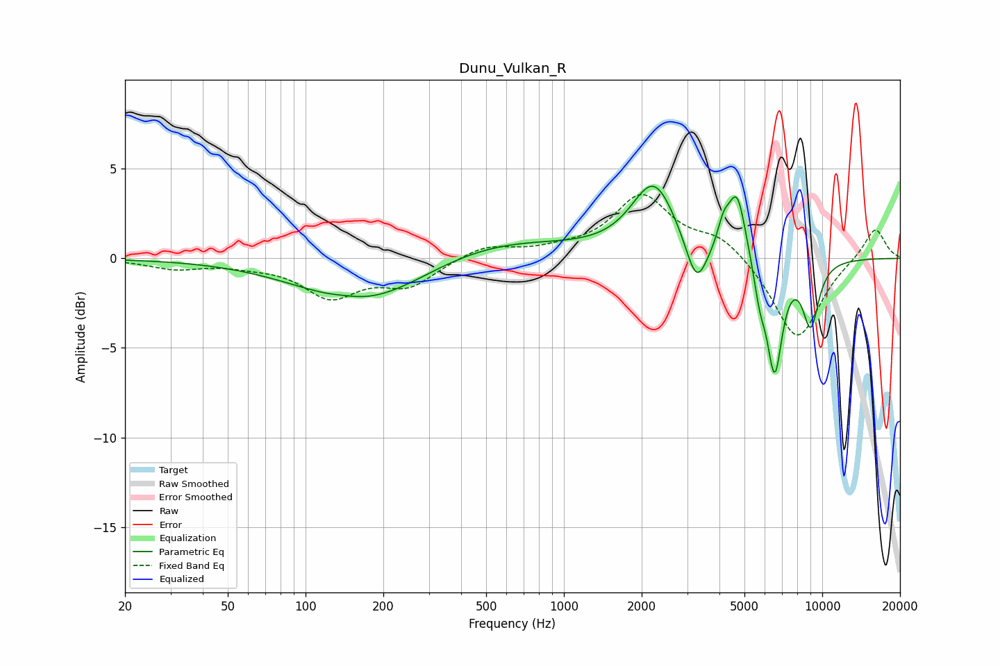

# Dunu_Vulkan_R
See [usage instructions](https://github.com/jaakkopasanen/AutoEq#usage) for more options and info.

### Parametric EQs
Apply preamp of -4.1 dB when using parametric equalizer.

|   # | Type    |   Fc (Hz) |    Q |   Gain (dB) |
|-----|---------|-----------|------|-------------|
|   1 | Peaking |       142 | 2.4  |         0.1 |
|   2 | Peaking |       172 | 0.56 |        -2.7 |
|   3 | Peaking |       501 | 0.45 |         1.3 |
|   4 | Peaking |      2231 | 1.64 |         4.1 |
|   5 | Peaking |      3263 | 3.38 |        -2.7 |
|   6 | Peaking |      4150 | 6    |         1.3 |
|   7 | Peaking |      4683 | 4.08 |         3.6 |
|   8 | Peaking |      5732 | 5.98 |        -1.7 |
|   9 | Peaking |      6540 | 4.46 |        -6.2 |
|  10 | Peaking |      9025 | 4    |        -3.5 |

### Fixed Band EQs
When using fixed band (also called graphic) equalizer, apply preamp of **-3.7 dB** (if available) and set gains manually with these parameters.

|   # | Type    |   Fc (Hz) |    Q |   Gain (dB) |
|-----|---------|-----------|------|-------------|
|   1 | Peaking |        31 | 1.41 |        -0.5 |
|   2 | Peaking |        62 | 1.41 |        -0.3 |
|   3 | Peaking |       125 | 1.41 |        -2   |
|   4 | Peaking |       250 | 1.41 |        -1.4 |
|   5 | Peaking |       500 | 1.41 |         0.7 |
|   6 | Peaking |      1000 | 1.41 |         0.3 |
|   7 | Peaking |      2000 | 1.41 |         3.4 |
|   8 | Peaking |      4000 | 1.41 |         1.2 |
|   9 | Peaking |      8000 | 1.41 |        -4.6 |
|  10 | Peaking |     16000 | 1.41 |         1.8 |

### Graphs

