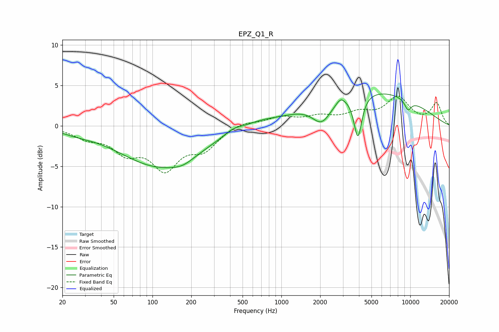

# EPZ_Q1_R
See [usage instructions](https://github.com/jaakkopasanen/AutoEq#usage) for more options and info.

### Parametric EQs
Apply preamp of -4.0 dB when using parametric equalizer.

|   # | Type    |   Fc (Hz) |    Q |   Gain (dB) |
|-----|---------|-----------|------|-------------|
|   1 | Peaking |        26 | 1.34 |        -0.3 |
|   2 | Peaking |       115 | 0.45 |        -4.9 |
|   3 | Peaking |       171 | 1.65 |        -0.7 |
|   4 | Peaking |       423 | 1.99 |         0.7 |
|   5 | Peaking |       677 | 1.23 |         0.5 |
|   6 | Peaking |      2059 | 1.9  |        -2.7 |
|   7 | Peaking |      2879 | 4.42 |         0.7 |
|   8 | Peaking |      3921 | 4.57 |        -5.4 |
|   9 | Peaking |      4673 | 0.3  |         4.5 |
|  10 | Peaking |      9593 | 4.59 |        -1.3 |

### Fixed Band EQs
When using fixed band (also called graphic) equalizer, apply preamp of **-3.8 dB** (if available) and set gains manually with these parameters.

|   # | Type    |   Fc (Hz) |    Q |   Gain (dB) |
|-----|---------|-----------|------|-------------|
|   1 | Peaking |        31 | 1.41 |        -1.2 |
|   2 | Peaking |        62 | 1.41 |        -2.8 |
|   3 | Peaking |       125 | 1.41 |        -4.8 |
|   4 | Peaking |       250 | 1.41 |        -2.5 |
|   5 | Peaking |       500 | 1.41 |         0.6 |
|   6 | Peaking |      1000 | 1.41 |         1   |
|   7 | Peaking |      2000 | 1.41 |         1   |
|   8 | Peaking |      4000 | 1.41 |         1.3 |
|   9 | Peaking |      8000 | 1.41 |         3.3 |
|  10 | Peaking |     16000 | 1.41 |         2.7 |

### Graphs

