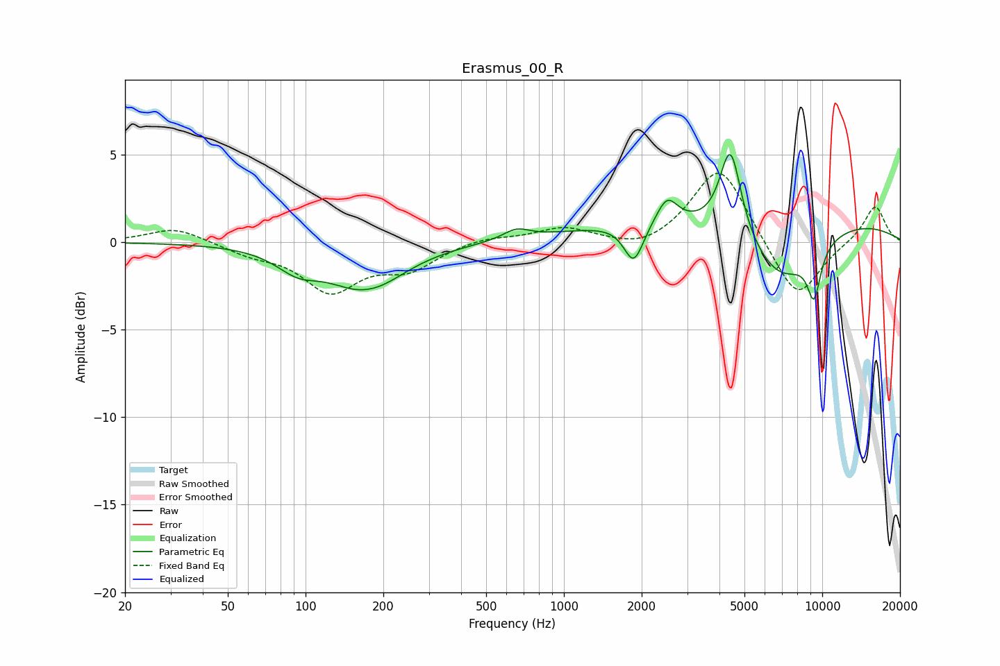

# Erasmus_00_R
See [usage instructions](https://github.com/jaakkopasanen/AutoEq#usage) for more options and info.

### Parametric EQs
Apply preamp of -5.1 dB when using parametric equalizer.

|   # | Type    |   Fc (Hz) |    Q |   Gain (dB) |
|-----|---------|-----------|------|-------------|
|   1 | Peaking |        93 | 1.72 |        -1.1 |
|   2 | Peaking |       172 | 1.01 |        -2.7 |
|   3 | Peaking |       174 | 2.16 |         0.2 |
|   4 | Peaking |       655 | 2.76 |         0.6 |
|   5 | Peaking |      1865 | 3.73 |        -2.3 |
|   6 | Peaking |      2509 | 3.55 |         1.5 |
|   7 | Peaking |      4413 | 3.41 |         5.1 |
|   8 | Peaking |      6012 | 0.18 |         1.6 |
|   9 | Peaking |      6897 | 1.01 |        -3.5 |
|  10 | Peaking |      9294 | 4.83 |        -2.8 |

### Fixed Band EQs
When using fixed band (also called graphic) equalizer, apply preamp of **-4.0 dB** (if available) and set gains manually with these parameters.

|   # | Type    |   Fc (Hz) |    Q |   Gain (dB) |
|-----|---------|-----------|------|-------------|
|   1 | Peaking |        31 | 1.41 |         0.9 |
|   2 | Peaking |        62 | 1.41 |        -0.6 |
|   3 | Peaking |       125 | 1.41 |        -2.7 |
|   4 | Peaking |       250 | 1.41 |        -1.4 |
|   5 | Peaking |       500 | 1.41 |         0.3 |
|   6 | Peaking |      1000 | 1.41 |         0.8 |
|   7 | Peaking |      2000 | 1.41 |        -0.6 |
|   8 | Peaking |      4000 | 1.41 |         4.5 |
|   9 | Peaking |      8000 | 1.41 |        -3.4 |
|  10 | Peaking |     16000 | 1.41 |         2.1 |

### Graphs

