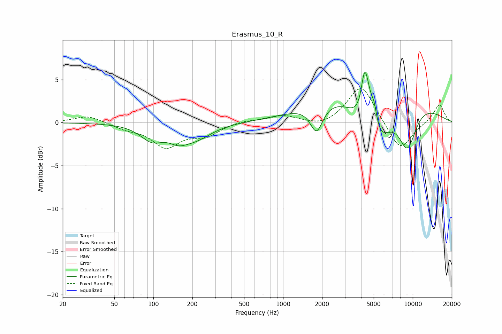

# Erasmus_10_R
See [usage instructions](https://github.com/jaakkopasanen/AutoEq#usage) for more options and info.

### Parametric EQs
Apply preamp of -6.0 dB when using parametric equalizer.

|   # | Type    |   Fc (Hz) |    Q |   Gain (dB) |
|-----|---------|-----------|------|-------------|
|   1 | Peaking |        97 | 1.63 |        -1.8 |
|   2 | Peaking |       155 | 1.91 |        -1.2 |
|   3 | Peaking |       211 | 1.14 |        -1.6 |
|   4 | Peaking |      1811 | 2.91 |        -3.2 |
|   5 | Peaking |      4227 | 5.97 |         3   |
|   6 | Peaking |      4441 | 3.55 |         4.9 |
|   7 | Peaking |      4990 | 0.99 |       -10.1 |
|   8 | Peaking |      5029 | 5.37 |         2.8 |
|   9 | Peaking |      5058 | 0.37 |         7.4 |
|  10 | Peaking |      9091 | 1.77 |        -5.4 |

### Fixed Band EQs
When using fixed band (also called graphic) equalizer, apply preamp of **-4.0 dB** (if available) and set gains manually with these parameters.

|   # | Type    |   Fc (Hz) |    Q |   Gain (dB) |
|-----|---------|-----------|------|-------------|
|   1 | Peaking |        31 | 1.41 |         0.9 |
|   2 | Peaking |        62 | 1.41 |        -0.6 |
|   3 | Peaking |       125 | 1.41 |        -2.7 |
|   4 | Peaking |       250 | 1.41 |        -1.4 |
|   5 | Peaking |       500 | 1.41 |         0.3 |
|   6 | Peaking |      1000 | 1.41 |         0.8 |
|   7 | Peaking |      2000 | 1.41 |        -0.6 |
|   8 | Peaking |      4000 | 1.41 |         4.5 |
|   9 | Peaking |      8000 | 1.41 |        -3.4 |
|  10 | Peaking |     16000 | 1.41 |         2.2 |

### Graphs

