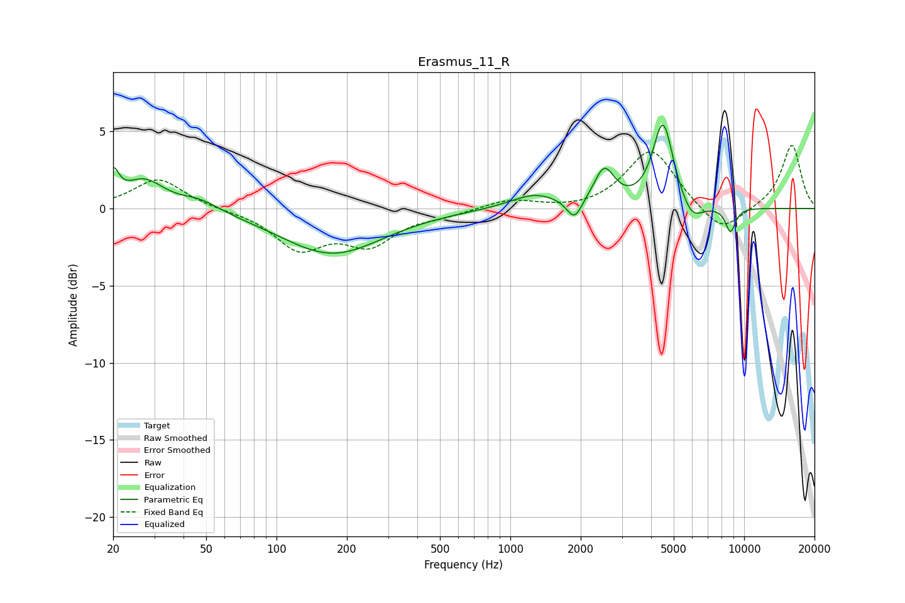

# Erasmus_11_R
See [usage instructions](https://github.com/jaakkopasanen/AutoEq#usage) for more options and info.

### Parametric EQs
Apply preamp of -5.5 dB when using parametric equalizer.

|   # | Type    |   Fc (Hz) |    Q |   Gain (dB) |
|-----|---------|-----------|------|-------------|
|   1 | Peaking |        20 | 5.96 |         1.8 |
|   2 | Peaking |        27 | 1.67 |         1.8 |
|   3 | Peaking |        47 | 1.62 |         0.7 |
|   4 | Peaking |       173 | 0.65 |        -2.9 |
|   5 | Peaking |      1272 | 1.36 |         0.9 |
|   6 | Peaking |      1881 | 4.35 |        -1.4 |
|   7 | Peaking |      2524 | 3.26 |         2.3 |
|   8 | Peaking |      4497 | 3.23 |         5.6 |
|   9 | Peaking |      5975 | 2.98 |        -1.3 |
|  10 | Peaking |      8742 | 5.97 |        -1.6 |

### Fixed Band EQs
When using fixed band (also called graphic) equalizer, apply preamp of **-4.2 dB** (if available) and set gains manually with these parameters.

|   # | Type    |   Fc (Hz) |    Q |   Gain (dB) |
|-----|---------|-----------|------|-------------|
|   1 | Peaking |        31 | 1.41 |         2   |
|   2 | Peaking |        62 | 1.41 |        -0.1 |
|   3 | Peaking |       125 | 1.41 |        -2.5 |
|   4 | Peaking |       250 | 1.41 |        -2.1 |
|   5 | Peaking |       500 | 1.41 |        -0.4 |
|   6 | Peaking |      1000 | 1.41 |         0.6 |
|   7 | Peaking |      2000 | 1.41 |        -0.2 |
|   8 | Peaking |      4000 | 1.41 |         3.9 |
|   9 | Peaking |      8000 | 1.41 |        -1.8 |
|  10 | Peaking |     16000 | 1.41 |         4.2 |

### Graphs

