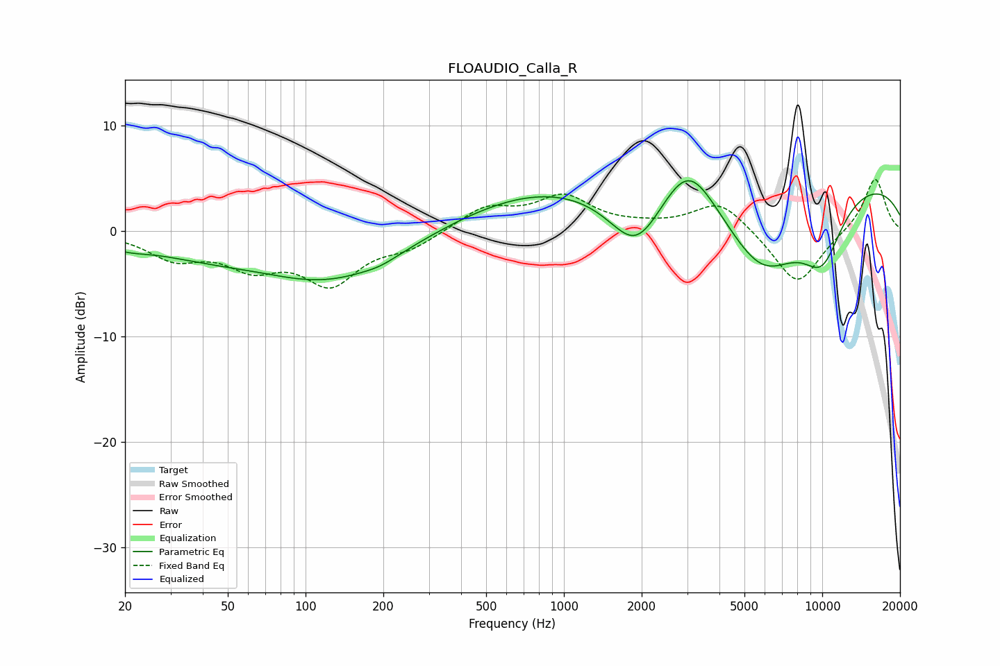

# FLOAUDIO_Calla_R
See [usage instructions](https://github.com/jaakkopasanen/AutoEq#usage) for more options and info.

### Parametric EQs
Apply preamp of -4.9 dB when using parametric equalizer.

|   # | Type    |   Fc (Hz) |    Q |   Gain (dB) |
|-----|---------|-----------|------|-------------|
|   1 | Peaking |        20 | 1.72 |        -0.7 |
|   2 | Peaking |        38 | 0.64 |        -1.5 |
|   3 | Peaking |       126 | 0.51 |        -4.6 |
|   4 | Peaking |       195 | 2.27 |        -0.4 |
|   5 | Peaking |       814 | 0.42 |         3.6 |
|   6 | Peaking |      1907 | 1.32 |        -5.8 |
|   7 | Peaking |      3034 | 1.34 |         5.3 |
|   8 | Peaking |      5859 | 0.81 |        -8.5 |
|   9 | Peaking |      9053 | 0.18 |         5.6 |
|  10 | Peaking |     10000 | 1.51 |        -5.4 |

### Fixed Band EQs
When using fixed band (also called graphic) equalizer, apply preamp of **-5.0 dB** (if available) and set gains manually with these parameters.

|   # | Type    |   Fc (Hz) |    Q |   Gain (dB) |
|-----|---------|-----------|------|-------------|
|   1 | Peaking |        31 | 1.41 |        -2.3 |
|   2 | Peaking |        62 | 1.41 |        -2.9 |
|   3 | Peaking |       125 | 1.41 |        -4.6 |
|   4 | Peaking |       250 | 1.41 |        -1.4 |
|   5 | Peaking |       500 | 1.41 |         2.2 |
|   6 | Peaking |      1000 | 1.41 |         3.1 |
|   7 | Peaking |      2000 | 1.41 |         0.3 |
|   8 | Peaking |      4000 | 1.41 |         2.9 |
|   9 | Peaking |      8000 | 1.41 |        -5.3 |
|  10 | Peaking |     16000 | 1.41 |         5.2 |

### Graphs

