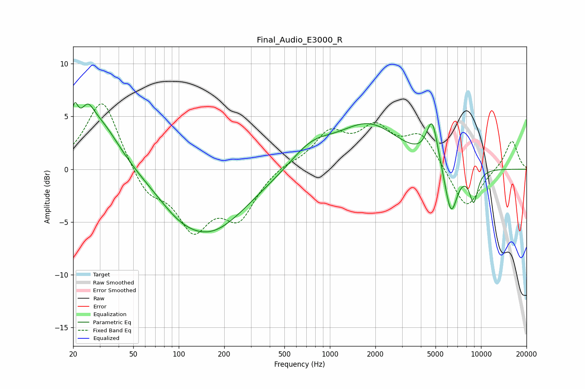

# Final_Audio_E3000_R
See [usage instructions](https://github.com/jaakkopasanen/AutoEq#usage) for more options and info.

### Parametric EQs
Apply preamp of -6.4 dB when using parametric equalizer.

|   # | Type    |   Fc (Hz) |    Q |   Gain (dB) |
|-----|---------|-----------|------|-------------|
|   1 | Peaking |        20 | 5.85 |         3   |
|   2 | Peaking |        25 | 3.31 |         2.2 |
|   3 | Peaking |        30 | 1.03 |         4.6 |
|   4 | Peaking |        99 | 1.12 |        -0.9 |
|   5 | Peaking |       160 | 0.56 |        -5.8 |
|   6 | Peaking |       754 | 1.01 |         2   |
|   7 | Peaking |      1815 | 0.69 |         4   |
|   8 | Peaking |      4755 | 3.71 |         4.1 |
|   9 | Peaking |      6332 | 3.24 |        -4.8 |
|  10 | Peaking |      8942 | 4.44 |        -3   |

### Fixed Band EQs
When using fixed band (also called graphic) equalizer, apply preamp of **-6.3 dB** (if available) and set gains manually with these parameters.

|   # | Type    |   Fc (Hz) |    Q |   Gain (dB) |
|-----|---------|-----------|------|-------------|
|   1 | Peaking |        31 | 1.41 |         6.8 |
|   2 | Peaking |        62 | 1.41 |        -2.4 |
|   3 | Peaking |       125 | 1.41 |        -5.2 |
|   4 | Peaking |       250 | 1.41 |        -4.2 |
|   5 | Peaking |       500 | 1.41 |         0.5 |
|   6 | Peaking |      1000 | 1.41 |         3.2 |
|   7 | Peaking |      2000 | 1.41 |         3.4 |
|   8 | Peaking |      4000 | 1.41 |         3.1 |
|   9 | Peaking |      8000 | 1.41 |        -4   |
|  10 | Peaking |     16000 | 1.41 |         2.8 |

### Graphs

