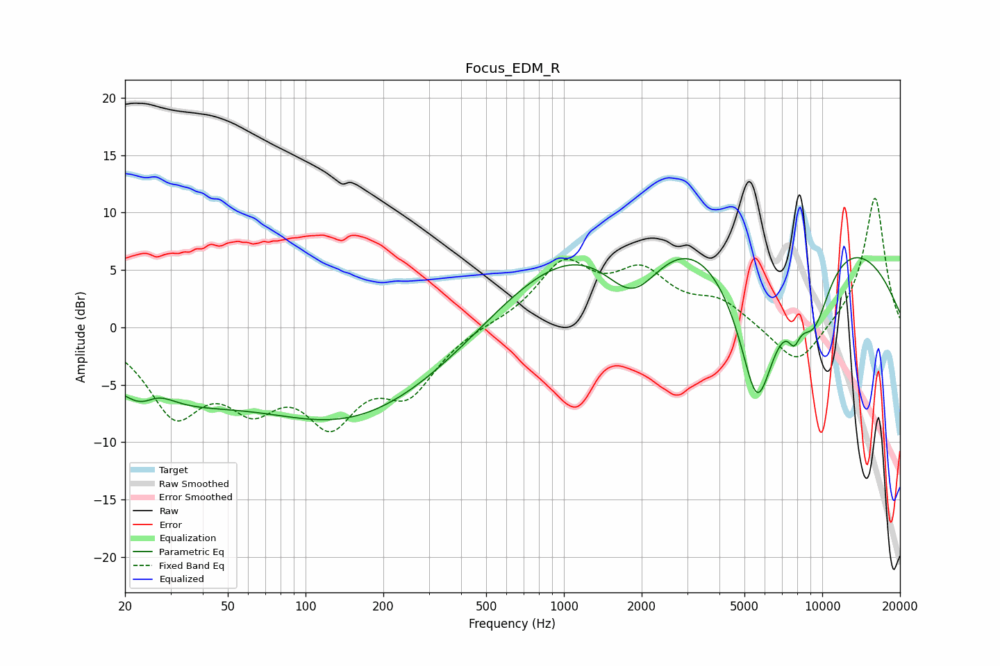

# Focus_EDM_R
See [usage instructions](https://github.com/jaakkopasanen/AutoEq#usage) for more options and info.

### Parametric EQs
Apply preamp of -6.2 dB when using parametric equalizer.

|   # | Type    |   Fc (Hz) |    Q |   Gain (dB) |
|-----|---------|-----------|------|-------------|
|   1 | Peaking |        24 | 1.92 |        -3.4 |
|   2 | Peaking |        26 | 1.94 |         3.5 |
|   3 | Peaking |        27 | 0.51 |        -5.1 |
|   4 | Peaking |       146 | 0.38 |        -7.5 |
|   5 | Peaking |       376 | 0.55 |        -1.4 |
|   6 | Peaking |      1856 | 1.09 |        -7.5 |
|   7 | Peaking |      4102 | 0.18 |        16.6 |
|   8 | Peaking |      5597 | 1.17 |       -20   |
|   9 | Peaking |      7780 | 5.86 |        -1.9 |
|  10 | Peaking |      9276 | 1.85 |        -6   |

### Fixed Band EQs
When using fixed band (also called graphic) equalizer, apply preamp of **-11.3 dB** (if available) and set gains manually with these parameters.

|   # | Type    |   Fc (Hz) |    Q |   Gain (dB) |
|-----|---------|-----------|------|-------------|
|   1 | Peaking |        31 | 1.41 |        -6.8 |
|   2 | Peaking |        62 | 1.41 |        -5.2 |
|   3 | Peaking |       125 | 1.41 |        -7   |
|   4 | Peaking |       250 | 1.41 |        -4.9 |
|   5 | Peaking |       500 | 1.41 |         0.2 |
|   6 | Peaking |      1000 | 1.41 |         5.3 |
|   7 | Peaking |      2000 | 1.41 |         4.2 |
|   8 | Peaking |      4000 | 1.41 |         2   |
|   9 | Peaking |      8000 | 1.41 |        -3.7 |
|  10 | Peaking |     16000 | 1.41 |        11.5 |

### Graphs

