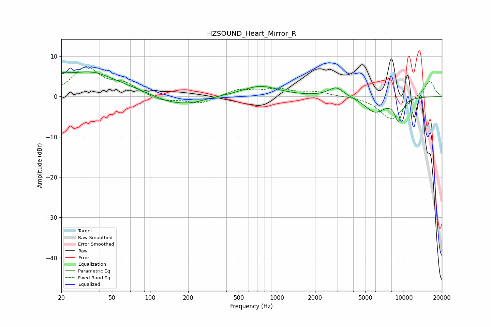

# HZSOUND_Heart_Mirror_R
See [usage instructions](https://github.com/jaakkopasanen/AutoEq#usage) for more options and info.

### Parametric EQs
Apply preamp of -6.2 dB when using parametric equalizer.

|   # | Type    |   Fc (Hz) |    Q |   Gain (dB) |
|-----|---------|-----------|------|-------------|
|   1 | Peaking |        20 | 0.26 |         5.3 |
|   2 | Peaking |        22 | 5.92 |         3.2 |
|   3 | Peaking |        22 | 6    |        -2.9 |
|   4 | Peaking |        36 | 1.2  |         1.4 |
|   5 | Peaking |       147 | 0.85 |        -2.3 |
|   6 | Peaking |       222 | 1.47 |        -0.8 |
|   7 | Peaking |       740 | 1    |         2.6 |
|   8 | Peaking |      2941 | 2.35 |         2.4 |
|   9 | Peaking |      5933 | 1.7  |        -3.8 |
|  10 | Peaking |      9081 | 4.24 |        -5.4 |

### Fixed Band EQs
When using fixed band (also called graphic) equalizer, apply preamp of **-7.5 dB** (if available) and set gains manually with these parameters.

|   # | Type    |   Fc (Hz) |    Q |   Gain (dB) |
|-----|---------|-----------|------|-------------|
|   1 | Peaking |        31 | 1.41 |         7   |
|   2 | Peaking |        62 | 1.41 |         2.7 |
|   3 | Peaking |       125 | 1.41 |        -1.3 |
|   4 | Peaking |       250 | 1.41 |        -1.8 |
|   5 | Peaking |       500 | 1.41 |         1.8 |
|   6 | Peaking |      1000 | 1.41 |         1.7 |
|   7 | Peaking |      2000 | 1.41 |         1.1 |
|   8 | Peaking |      4000 | 1.41 |         0.1 |
|   9 | Peaking |      8000 | 1.41 |        -5.8 |
|  10 | Peaking |     16000 | 1.41 |         4   |

### Graphs

